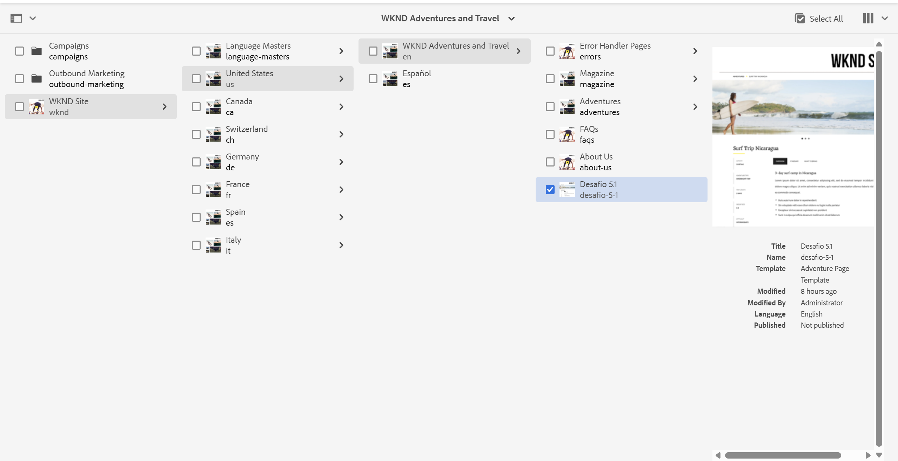
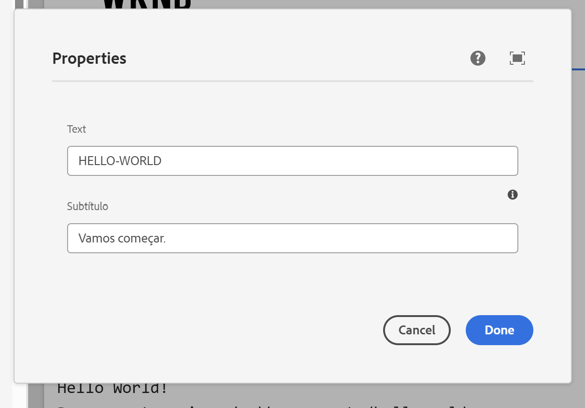
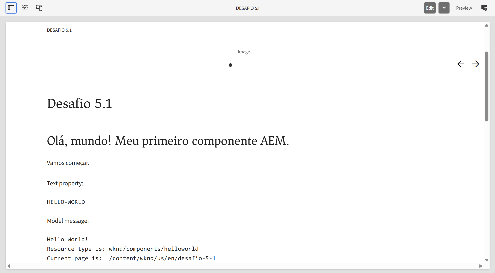
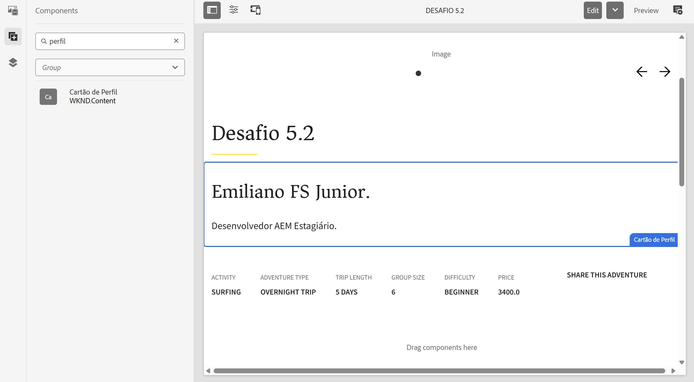
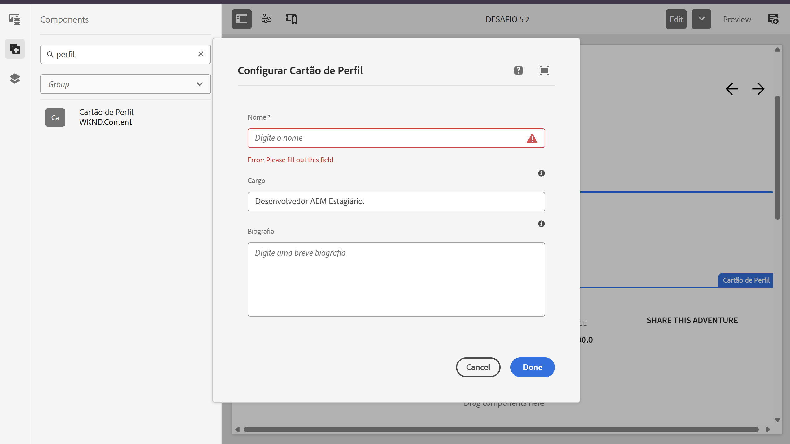
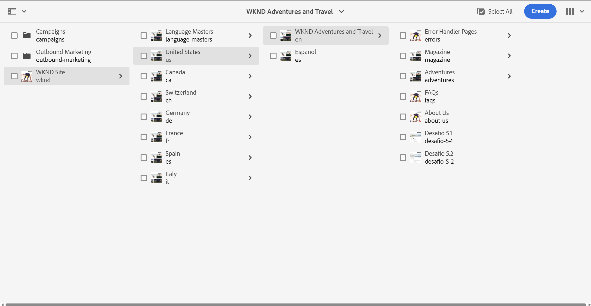
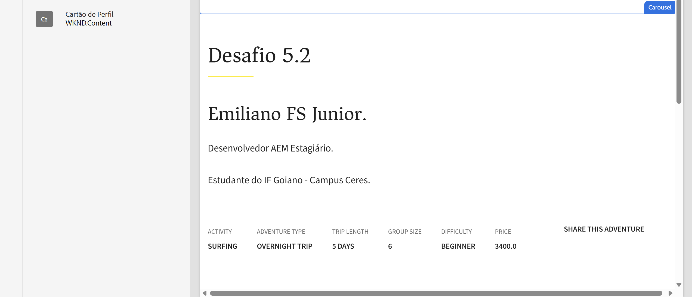
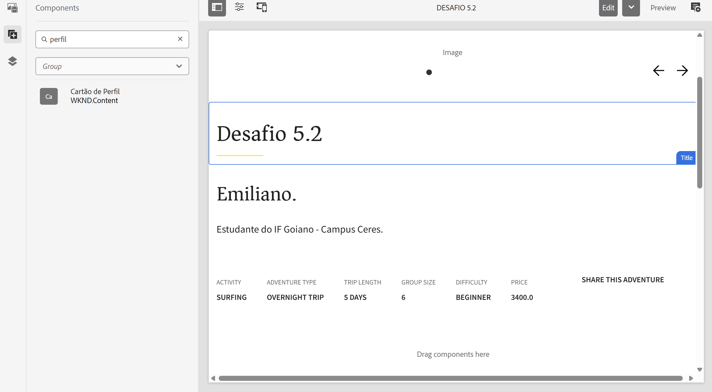

# Estágio AI/R — Shopify e Adobe Experience Manager

Repositório criado para armazenar os exercícios, desafios e atividades práticas desenvolvidos durante o programa de estágio/bootcamp da AI/R.

A trilha contempla fundamentos de desenvolvimento web, Git, GitHub, JavaScript, Shopify, Liquid, performance e Adobe Experience Manager — AEM.

---

## 📌 Sobre o projeto

O objetivo deste repositório é registrar a evolução técnica durante o programa de estágio, reunindo código, documentação e evidências das atividades realizadas.

Durante as semanas do programa, foram praticados conceitos como:

- Fluxo profissional com Git e GitHub
- Criação e gerenciamento de branches
- Commits semânticos
- Pull Requests
- Code Review
- Identificação e correção de bugs
- Uso crítico de inteligência artificial
- Desenvolvimento de temas Shopify
- Linguagem Liquid
- Sections e snippets reutilizáveis
- Blocks dinâmicos
- Metafields e metaobjects
- Responsividade
- Acessibilidade
- Auditoria e otimização de performance
- Fundamentos do Adobe Experience Manager
- Desenvolvimento de componentes AEM
- HTL
- Sling Models
- Dialogs Touch UI
- JCR
- Maven
- Bundles OSGi

---

# 📁 Estrutura do repositório

```text
bootcamp-2-ecommerce/
├── exercicios/
│   ├── semana-1/
│   │   ├── sobre-mim.md
│   │   ├── calculadora.js
│   │   ├── caca-bugs.md
│   │   ├── caca-bugs-corrigido.js
│   │   ├── sem-ia.js
│   │   ├── com-ia.js
│   │   ├── reflexao-ia.md
│   │   └── quando-usar-ia.md
│   │
│   ├── semana-2/
│   │   ├── sections/
│   │   │   ├── exercicio-liquid-basico.liquid
│   │   │   ├── exercicio-product-grid.liquid
│   │   │   └── exercicios-filtros.liquid
│   │   ├── snippets/
│   │   │   └── product-card.liquid
│   │   └── quando-usar-IA-liquid.md
│   │
│   ├── semana-3/
│   │   ├── hero-banner.liquid
│   │   ├── section-hero-banner.css
│   │   ├── product-extra-info.liquid
│   │   ├── section-product-extra-info.css
│   │   ├── brand-info.liquid
│   │   └── section-brand-info.css
│   │
│   ├── semana-4/
│   │   ├── 4.1-Performance-audit/
│   │   │   ├── dawn/
│   │   │   ├── desafios/
│   │   │   └── docs/
│   │   │
│   │   └── 4.2-Tema-customizado/
│   │       ├── assets/
│   │       ├── sections/
│   │       └── docs/
│   │
│   └── semana-5/
│       ├── 5.1-helloworld-subtitle/
│       │   ├── docs/
│       │   │   ├── pagina-desafio-5-1.png
│       │   │   ├── dialog-subtitulo.png
│       │   │   └── helloworld-renderizado.png
│       │   ├── .content.xml
│       │   ├── helloworld.html
│       │   └── HelloWorldModel.java
│       │
│       └── 5.2-componente-cartao-perfil/
│           ├── docs/
│           │   ├── componente-no-painel.png
│           │   ├── dialog-perfil.png
│           │   ├── pagina-desafio.png
│           │   ├── perfil-com-cargo.png
│           │   └── perfil-sem-cargo.png
│           ├── models/
│           │   └── PerfilModel.java
│           └── perfil/
│               ├── .content.xml
│               ├── perfil.html
│               └── _cq_dialog/
│                   └── .content.xml
│
├── .gitignore
└── README.md
```

> Os arquivos foram organizados por semana e por desafio para facilitar a avaliação.

> Os arquivos presentes nos diretórios dos desafios 5.1 e 5.2 representam as partes criadas ou modificadas no projeto WKND original. O projeto AEM completo permanece no ambiente local de desenvolvimento.

---

# ✅ Semana 1 — Git, JavaScript e IA

## Desafio 1.1 — Fluxo Git Profissional

Neste desafio, foram praticadas as principais etapas de um fluxo profissional com Git e GitHub.

### Atividades realizadas

- Criação de branch a partir da `main`
- Organização dos arquivos em pastas
- Criação de apresentação pessoal
- Implementação de calculadora em JavaScript
- Adição da função de porcentagem
- Uso de commits semânticos
- Abertura de Pull Request
- Revisão de código de colega

### Arquivos relacionados

- `exercicios/semana-1/sobre-mim.md`
- `exercicios/semana-1/calculadora.js`

---

## Desafio 1.2 — Caça aos Bugs da IA

O objetivo foi desenvolver um olhar crítico sobre códigos gerados por inteligência artificial.

Foram analisados problemas relacionados a:

- Validação de e-mail
- Busca de produto em array
- Cálculo de desconto
- Formatação de preço
- Tratamento de valores inválidos
- Casos extremos

### Arquivos relacionados

- `exercicios/semana-1/caca-bugs.md`
- `exercicios/semana-1/caca-bugs-corrigido.js`

---

## Desafio 1.3 — Copilot: com e sem IA

Foram implementadas funções manualmente e com auxílio do GitHub Copilot.

### Funções implementadas

- `inverterString(str)`
- `contarVogais(str)`
- `encontrarMaior(numeros)`
- `removerDuplicatas(array)`

Também foi feita uma reflexão comparando:

- Tempo gasto
- Qualidade do código
- Clareza das soluções
- Tratamento de casos extremos
- Aprendizado durante o processo
- Limitações do uso de IA

### Arquivos relacionados

- `exercicios/semana-1/sem-ia.js`
- `exercicios/semana-1/com-ia.js`
- `exercicios/semana-1/reflexao-ia.md`
- `exercicios/semana-1/quando-usar-ia.md`

---

# ✅ Semana 2 — Shopify, Liquid e Temas

Durante a Semana 2, o foco foi compreender a estrutura de temas Shopify e os fundamentos da linguagem Liquid.

## Desafio 2.1 — Section Liquid básica

Foi criada uma section configurável pelo editor visual da Shopify.

### Funcionalidades implementadas

- Título configurável
- Descrição em richtext
- Seleção de coleção
- Loop de produtos
- Exibição de imagem, título e preço
- Uso do filtro `money`
- Controle da quantidade de produtos
- Alternância entre grade e lista
- Cor de fundo configurável
- Botão para visualizar todos os produtos

### Arquivo relacionado

- `exercicios/semana-2/sections/exercicio-liquid-basico.liquid`

---

## Desafio 2.2 — Filtros e condicionais Liquid

Foi criada uma section com filtros e lógica condicional para exibição de produtos.

### Funcionalidades implementadas

- Seleção de coleção
- Uso de `upcase`
- Uso de `capitalize`
- Formatação com `money`
- Uso de `strip_html`
- Uso de `truncate`
- Imagens com `image_url`
- Badge de promoção
- Badge de produto esgotado
- Badge de produto disponível
- Cálculo de desconto
- Contagem de produtos em promoção
- Resumo dinâmico com `capture`

### Arquivo relacionado

- `exercicios/semana-2/sections/exercicios-filtros.liquid`

---

## Desafio 2.3 — Snippet reutilizável

Foi criado um snippet reutilizável de produto e uma section que utiliza o snippet com ``.

### Funcionalidades

- Imagem do produto
- Título com link
- Preço atual
- Preço original em promoções
- Badge de desconto
- Badge de produto esgotado
- Botão de adicionar ao carrinho
- Botão desabilitado para produtos indisponíveis
- Layout responsivo

### Arquivos relacionados

- `exercicios/semana-2/snippets/product-card.liquid`
- `exercicios/semana-2/sections/exercicio-product-grid.liquid`

---

# ✅ Semana 3 — Metafields, Metaobjects e Blocks

Durante a Semana 3, o foco foi aprofundar a personalização de temas Shopify.

## Desafio 3.1 — Hero Banner com Blocks

Foi criada uma section Hero Banner flexível e configurável.

### Funcionalidades implementadas

- Imagem de fundo
- Overlay configurável
- Altura mínima
- Alinhamento do conteúdo
- Block de título
- Block de parágrafo
- Block de botão
- Block de imagem
- Adição, remoção e reordenação de blocks
- Layout responsivo

### Arquivos relacionados

- `exercicios/semana-3/hero-banner.liquid`
- `exercicios/semana-3/section-hero-banner.css`

---

## Desafio 3.2 — Metafields e Metaobjects

Foram criadas estruturas de dados personalizadas para páginas de produto.

### Funcionalidades

- Metafield de material
- Metafield de instruções de cuidado
- Metafield de vídeo
- Metaobject de informações da marca
- Logo
- Descrição
- Site
- País
- Referência de metaobject ligada ao produto
- Exibição condicional dos dados

### Arquivos relacionados

- `exercicios/semana-3/product-extra-info.liquid`
- `exercicios/semana-3/brand-info.liquid`
- `exercicios/semana-3/section-product-extra-info.css`
- `exercicios/semana-3/section-brand-info.css`

---

# ✅ Semana 4 — Performance e Tema Customizado

Durante a Semana 4, o foco foi auditar um tema Shopify e desenvolver sections customizadas para o tema Dawn.

## Desafio 4.1 — Auditoria de Performance

Foi realizada uma auditoria de performance e qualidade no tema.

### Otimizações implementadas

- Lazy loading em imagens abaixo da dobra
- `loading="eager"` em imagens prioritárias
- Uso de `fetchpriority="high"`
- Inclusão de `width` e `height`
- Redução de layout shift
- Critical CSS
- Carregamento assíncrono de CSS
- JavaScript com `defer` ou `async`
- Limites em loops Liquid
- Revisão de lookups repetidos
- Correções indicadas pelo Theme Check
- Auditoria com Lighthouse
- Comparação antes e depois

### Evidências

- Prints do Lighthouse
- Print do Theme Check
- Relatório de performance
- Comparação dos resultados

### Diretórios relacionados

- `exercicios/semana-4/4.1-Performance-audit/dawn`
- `exercicios/semana-4/4.1-Performance-audit/desafios`
- `exercicios/semana-4/4.1-Performance-audit/docs`

---

## Desafio 4.2 — Tema Customizado

Foram desenvolvidas três sections customizadas:

- FAQ Custom
- Benefícios do produto
- Preparo do produto

### FAQ Custom

#### Funcionalidades

- Accordion com `<details>` e `<summary>`
- Block de categoria
- Block de pergunta e resposta
- Blocks reordenáveis
- Compatibilidade com editor visual
- JavaScript com `defer`
- Layout responsivo
- Foco visível
- Suporte a `prefers-reduced-motion`

### Benefícios do produto

#### Funcionalidades

- Cards criados por blocks
- Ícone configurável
- Título e descrição
- Cores configuráveis
- Bordas configuráveis
- Arredondamento
- Layout responsivo
- Imagens com lazy loading
- Dimensões definidas

### Preparo do produto

#### Funcionalidades

- Cards configuráveis
- Ícone opcional
- Nome da etapa
- Valor manual de reserva
- Integração com metafields
- Cores e bordas configuráveis
- Layout responsivo
- Fallback quando o metafield está vazio

### Metafields utilizados

| Nome | Namespace e chave | Tipo |
|---|---|---|
| Temperatura de preparo | `custom.temperatura_preparo` | Texto de linha única |
| Tempo de infusão | `custom.tempo_infusao` | Texto de linha única |
| Quantidade recomendada | `custom.quantidade_recomendada` | Texto de linha única |

### Diretório relacionado

- `exercicios/semana-4/4.2-Tema-customizado`

---

# ✅ Semana 5 — Adobe Experience Manager

Durante a Semana 5, o foco foi conhecer os fundamentos do **Adobe Experience Manager — AEM Sites**, configurar o ambiente local e realizar o primeiro ciclo completo de desenvolvimento no projeto WKND.

O fluxo praticado foi:

```text
editar → compilar → instalar → visualizar no Author
```

---

## Contextualização e arquitetura do AEM

O AEM separa conteúdo, lógica e apresentação em diferentes camadas.

### Principais elementos

- **Author:** ambiente onde páginas e componentes são criados e editados, disponível em `localhost:4502`
- **Publish:** ambiente que representa o conteúdo exibido ao visitante, normalmente na porta `4503`
- **JCR:** repositório onde páginas, componentes e propriedades são armazenados como nós
- **Dialog:** formulário usado pelo autor para configurar os campos de um componente
- **Sling Model:** classe Java responsável por ler dados do JCR e disponibilizá-los ao componente
- **HTL:** linguagem de template utilizada para renderizar o HTML
- **OSGi:** sistema modular utilizado para executar o código Java no AEM
- **Maven:** ferramenta responsável por compilar, empacotar e instalar o projeto

O fluxo básico de um componente é:

```text
Dialog
   ↓
Propriedade salva no JCR
   ↓
Sling Model
   ↓
HTL
   ↓
Página renderizada no Author
```

---

## Configuração do ambiente

O ambiente local foi preparado com:

- OpenJDK 21
- Apache Maven 3.9
- Node.js e npm
- Git
- Visual Studio Code
- AEM as a Cloud Service SDK
- AEM Author na porta `4502`
- Projeto de exemplo WKND

A estrutura local do SDK foi organizada em:

```text
C:\aem-sdk\
├── author\
├── publish\
└── dispatcher\
```

O Author foi iniciado pelo terminal:

```powershell
cd C:\aem-sdk\author
java -jar .\aem-author-p4502.jar
```

O projeto WKND foi compilado e instalado com:

```powershell
mvn clean install -PautoInstallSinglePackage
```

Após o deploy, o projeto ficou disponível em:

```text
AEM → Sites → WKND Site
```

---

## Desafio 5.1 — Ambiente e primeiro deploy do WKND

O objetivo do desafio foi validar o ambiente AEM e modificar o componente **HelloWorld**, adicionando um novo campo configurável chamado **Subtítulo**.

### Atividades realizadas

- Configuração do ambiente local
- Inicialização do AEM Author
- Clone e deploy do projeto WKND
- Criação da página `Desafio 5.1`
- Adição do componente HelloWorld
- Inclusão do campo `Subtítulo` no Dialog
- Leitura da propriedade pelo Sling Model
- Criação do método `getSubtitle()`
- Exibição do valor no HTL
- Renderização condicional com `data-sly-test`
- Validação do componente no Author

### Implementação do Dialog

O campo foi adicionado ao arquivo `.content.xml`:

```xml
<subtitle
    jcr:primaryType="nt:unstructured"
    sling:resourceType="granite/ui/components/coral/foundation/form/textfield"
    fieldLabel="Subtítulo"
    fieldDescription="Texto exibido abaixo do título do componente."
    emptyText="Digite um subtítulo"
    name="./subtitle"/>
```

A propriedade:

```xml
name="./subtitle"
```

faz com que o valor seja armazenado no JCR com o nome `subtitle`.

### Implementação do Sling Model

No `HelloWorldModel.java`, foi adicionada a leitura da propriedade:

```java
@ValueMapValue(
    name = "subtitle",
    injectionStrategy = InjectionStrategy.OPTIONAL
)
private String subtitle;

public String getSubtitle() {
    return subtitle;
}
```

### Implementação no HTL

No `helloworld.html`, o valor foi exibido com:

```html
<p
    class="cmp-helloworld__subtitle"
    data-sly-test="${model.subtitle}">
    ${model.subtitle}
</p>
```

O `data-sly-test` evita que o elemento seja renderizado quando o campo estiver vazio.

### Página criada no Author

Foi criada uma página específica para demonstrar o componente:

```text
/content/wknd/us/en/desafio-5-1
```

Valores utilizados:

```text
Text: HELLO-WORLD
Subtítulo: Vamos começar.
```

### Arquivos relacionados

- `exercicios/semana-5/5.1-helloworld-subtitle/.content.xml`
- `exercicios/semana-5/5.1-helloworld-subtitle/helloworld.html`
- `exercicios/semana-5/5.1-helloworld-subtitle/HelloWorldModel.java`

### Evidências

#### Página criada no Author



#### Dialog com o campo Subtítulo



#### Componente renderizado



### Principais aprendizados

- Diferença entre Author e Publish
- Organização modular do projeto WKND
- Função dos módulos `core` e `ui.apps`
- Persistência de propriedades no JCR
- Criação de campos em Dialogs Touch UI
- Uso de `@ValueMapValue`
- Comunicação entre Sling Model e HTL
- Deploy de bundles OSGi
- Renderização condicional com `data-sly-test`

#### Componente renderizado


### Principais aprendizados

## Desafio 5.2 — Componente Cartão de Perfil

O objetivo do desafio foi criar um componente AEM do zero, sem herdar de Core Component, para compreender a estrutura mínima necessária:

```text
nó do componente → Dialog Touch UI → Sling Model → HTL
```

Foi criado o componente **Cartão de Perfil**, com os campos:

- Nome
- Cargo
- Biografia

O campo **Cargo** é opcional e deixa de ser renderizado quando está vazio.

### Atividades realizadas

- Criação do componente em `/apps/wknd/components/perfil`
- Definição de `jcr:title`
- Definição de `componentGroup`
- Criação do Dialog Touch UI
- Criação dos campos Nome, Cargo e Biografia
- Persistência das propriedades no JCR
- Criação do `PerfilModel`
- Uso de `@ValueMapValue`
- Criação dos getters
- Carregamento do Model pelo HTL
- Renderização dos valores na página
- Uso de `data-sly-test` para ocultar o cargo vazio
- Deploy dos módulos `core` e `ui.apps`
- Criação da página `Desafio 5.2`
- Validação do componente no AEM Author

### Estrutura do componente

```text
5.2-componente-cartao-perfil/
├── docs/
│   ├── componente-no-painel.png
│   ├── dialog-perfil.png
│   ├── pagina-desafio.png
│   ├── perfil-com-cargo.png
│   └── perfil-sem-cargo.png
├── models/
│   └── PerfilModel.java
└── perfil/
    ├── .content.xml
    ├── perfil.html
    └── _cq_dialog/
        └── .content.xml
```

### Definição do componente

O componente foi registrado com:

```xml
<jcr:root
    xmlns:jcr="http://www.jcp.org/jcr/1.0"
    jcr:primaryType="cq:Component"
    jcr:title="Cartão de Perfil"
    componentGroup="WKND.Content"/>
```

A propriedade:

```xml
jcr:primaryType="cq:Component"
```

identifica o nó como um componente AEM.

O título apresentado ao autor é definido por:

```xml
jcr:title="Cartão de Perfil"
```

O grupo no painel de componentes é definido por:

```xml
componentGroup="WKND.Content"
```

O componente foi criado sem `sling:resourceSuperType`, portanto não herda comportamento de Core Component.

### Implementação do Dialog

O Dialog Touch UI possui os campos Nome, Cargo e Biografia.

As propriedades são salvas no nó da instância do componente por meio de:

```xml
name="./nome"
name="./cargo"
name="./bio"
```

O campo Nome foi definido como obrigatório:

```xml
required="{Boolean}true"
```

A Biografia utiliza um campo de múltiplas linhas:

```xml
sling:resourceType="granite/ui/components/coral/foundation/form/textarea"
```

Os valores configurados em `emptyText` funcionam apenas como orientação visual no formulário e não são armazenados no JCR.

### Implementação do Sling Model

O `PerfilModel` foi adaptado a partir de um `Resource` e associado ao componente:

```java
@Model(
    adaptables = Resource.class,
    resourceType = PerfilModel.RESOURCE_TYPE,
    defaultInjectionStrategy = DefaultInjectionStrategy.OPTIONAL
)
public class PerfilModel {
```

O tipo do componente foi centralizado em:

```java
public static final String RESOURCE_TYPE = "wknd/components/perfil";
```

As propriedades são injetadas com:

```java
@ValueMapValue
private String nome;

@ValueMapValue
private String cargo;

@ValueMapValue
private String bio;
```

Os valores são disponibilizados por meio dos getters:

```java
public String getNome() {
    return nome;
}

public String getCargo() {
    return cargo;
}

public String getBio() {
    return bio;
}
```

A estratégia `OPTIONAL` permite que o Model continue funcionando quando Cargo ou Biografia não forem preenchidos.

### Implementação no HTL

O Model é carregado no `perfil.html` por:

```html
data-sly-use.perfil="com.adobe.aem.guides.wknd.core.models.PerfilModel"
```

Os valores são exibidos com:

```html
${perfil.nome}
${perfil.cargo}
${perfil.bio}
```

O cargo é renderizado de forma condicional:

```html
<p
    class="cmp-perfil__cargo"
    data-sly-test="${perfil.cargo}">
    ${perfil.cargo}
</p>
```

Quando `perfil.cargo` está vazio ou ausente, a tag `<p>` não é incluída no HTML final.

### Deploy

O Sling Model foi compilado e instalado com:

```powershell
mvn -pl core install -PautoInstallBundle
```

O componente, o Dialog e o HTL foram instalados com:

```powershell
mvn -pl ui.apps install -PautoInstallPackage
```

### Página criada no Author

Foi criada uma página para validar o componente:

```text
/content/wknd/us/en/desafio-5-2
```

O componente foi localizado no grupo:

```text
WKND.Content
```

e adicionado à página **Desafio 5.2**.

### Testes realizados

#### Cargo preenchido

Foram utilizados os valores:

```text
Nome: Emiliano FS Junior.
Cargo: Desenvolvedor AEM Estagiário.
Biografia: Estudante do IF Goiano - Campus Ceres.
```

Os três valores foram exibidos corretamente.

#### Cargo vazio

O campo Cargo foi apagado e o Dialog foi salvo novamente.

O Nome e a Biografia continuaram visíveis, enquanto o Cargo deixou de ser renderizado.

Esse comportamento validou o uso correto de:

```html
data-sly-test="${perfil.cargo}"
```

### Arquivos relacionados

- `exercicios/semana-5/5.2-componente-cartao-perfil/models/PerfilModel.java`
- `exercicios/semana-5/5.2-componente-cartao-perfil/perfil/.content.xml`
- `exercicios/semana-5/5.2-componente-cartao-perfil/perfil/perfil.html`
- `exercicios/semana-5/5.2-componente-cartao-perfil/perfil/_cq_dialog/.content.xml`

### Evidências

#### Componente disponível no painel



#### Dialog Touch UI



#### Página criada no Author



#### Perfil com cargo preenchido



#### Perfil sem cargo



# ⚙️ Informações do Projeto

## Tecnologias utilizadas

- JavaScript
- HTML
- CSS
- Liquid
- Shopify
- Shopify CLI
- Dawn Theme
- Adobe Experience Manager
- AEM Sites
- HTL
- Apache Sling
- Sling Models
- JCR
- OSGi
- Java
- Maven
- Git
- GitHub
- GitHub Copilot
- Markdown
- Visual Studio Code

---

# Padrão de branches

As branches seguem o padrão:

```text
exercicio/numero-do-desafio-nome-do-desafio
```

Exemplos:

```text
exercicio/1.1-fluxo-git
exercicio/1.2-caca-bugs
exercicio/1.3-com-sem-ia
exercicio/2.1-liquid-basico
exercicio/2.2-filtros-condicionais
exercicio/2.3-snippet-reutilizavel
exercicio/4.1-performance-audit
exercicio/4.2-tema-customizado
exercicio/5.1-helloworld-subtitulo
exercicio/5.2-componente-cartao-perfil
```

---

# Padrão de commits

Os commits seguem o padrão de commits semânticos:

```text
feat: nova funcionalidade
fix: correção de problema
docs: alteração na documentação
refactor: melhoria interna sem mudança de comportamento
perf: melhoria de performance
test: criação ou alteração de testes
chore: configuração ou tarefa auxiliar
```

Exemplos:

```text
docs: adicionar apresentação pessoal
feat: criar calculadora com operações básicas
fix: corrigir bugs em código gerado por IA
feat: criar section Liquid básica
feat: criar snippet reutilizável de produto
perf: otimizar imagens do tema
feat: criar FAQ customizada
feat: integrar metafields na section de preparo
feat(helloworld): adicionar subtitulo configuravel
docs: documentar desafio 5.1
feat(perfil): criar componente cartao de perfil
docs: documentar desafio 5.2
```

---

# Como executar os arquivos JavaScript

Para executar os arquivos da Semana 1:

```bash
node exercicios/semana-1/calculadora.js
node exercicios/semana-1/caca-bugs-corrigido.js
node exercicios/semana-1/sem-ia.js
node exercicios/semana-1/com-ia.js
```

---

# Como testar os arquivos Shopify

## Iniciar o tema localmente

```bash
shopify theme dev --store=sua-loja.myshopify.com
```

## Executar o Theme Check

```bash
shopify theme check
```

Para mais detalhes:

```bash
shopify theme check --verbose
```

Meta:

```text
0 errors
```

---

# Como testar o AEM localmente

## 1. Iniciar o Author

```powershell
cd C:\aem-sdk\author
java -jar .\aem-author-p4502.jar
```

## 2. Abrir o Author

```text
http://localhost:4502
```

## 3. Entrar no projeto WKND

```text
Sites → WKND Site → United States → English
```

## 4. Abrir uma página de desafio

Desafio 5.1:

```text
/content/wknd/us/en/desafio-5-1
```

Desafio 5.2:

```text
/content/wknd/us/en/desafio-5-2
```

## 5. Testar o Desafio 5.1

1. Selecione o HelloWorld.
2. Clique no ícone de configuração.
3. Preencha `Text`.
4. Preencha `Subtítulo`.
5. Clique em `Done`.
6. Verifique o valor renderizado.

## 6. Testar o Desafio 5.2

1. Adicione o componente `Cartão de Perfil`.
2. Abra o Dialog.
3. Preencha Nome, Cargo e Biografia.
4. Clique em `Done`.
5. Confirme a exibição dos três valores.
6. Abra novamente o Dialog.
7. Apague o Cargo.
8. Salve e confirme que o Cargo não é renderizado.

---

# Organização do projeto

O repositório contém:

- Exercícios semanais
- Código JavaScript
- Sections Liquid
- Snippets reutilizáveis
- Arquivos CSS
- Relatórios de performance
- Screenshots
- Reflexões sobre IA
- Componentes AEM
- Sling Models
- Dialogs Touch UI
- Scripts HTL
- Documentação em Markdown
- Arquivo `.gitignore`
- README atualizado

---

# 📚 Aprendizados gerais

Durante as atividades, foram praticados conceitos importantes para o desenvolvimento profissional.

Entre os principais aprendizados estão:

- IA pode acelerar o desenvolvimento, mas o código precisa ser revisado
- Commits pequenos facilitam a análise
- Branches evitam alterações diretas na `main`
- Pull Requests organizam a revisão
- Blocks são indicados para conteúdos repetíveis
- Metafields são indicados para dados específicos
- Responsividade deve ser validada em diferentes tamanhos
- Imagens precisam de dimensões definidas
- Lazy loading ajuda a reduzir carregamentos desnecessários
- Theme Check e Lighthouse ajudam a identificar problemas
- O AEM separa conteúdo, apresentação e lógica
- Dialogs controlam os dados preenchidos pelo autor
- Sling Models concentram a lógica Java
- HTL deve concentrar a apresentação
- Código Java precisa ser empacotado como bundle OSGi
- Maven garante builds reproduzíveis
- Documentação e evidências fazem parte da entrega
- Estrutura mínima de um componente AEM
- Diferença entre os módulos `core` e `ui.apps`
- Registro de componentes com `cq:Component`
- Criação de Dialogs Touch UI
- Persistência de propriedades no JCR
- Injeção com `@ValueMapValue`
- Uso de getters no Sling Model
- Carregamento de Model com `data-sly-use`
- Renderização condicional com `data-sly-test`
- Componentes AEM podem ser construídos do zero sem herança de Core Component
- O módulo `core` concentra o código Java e o módulo `ui.apps` concentra componentes, Dialogs e HTL
- Deploy separado de bundle OSGi e pacote de conteúdo

---

# 👤 Autor

**Emiliano Souza**