# Estágio AI/R — Shopify e Adobe Experience Manager

Repositório criado para armazenar os exercícios, desafios e atividades práticas desenvolvidos durante o programa de estágio/bootcamp da AI/R.

A trilha contempla fundamentos de desenvolvimento web, Git, GitHub, JavaScript, Shopify, Liquid, performance e Adobe Experience Manager — AEM.

---

## 📌 Sobre o projeto

O objetivo deste repositório é registrar a evolução técnica durante o programa de estágio, reunindo código, documentação e evidências das atividades realizadas.

Durante as semanas do programa, foram praticados conceitos como:

- Fluxo profissional com Git e GitHub
- Criação e gerenciamento de branches
- Commits semânticos
- Pull Requests
- Code Review
- Identificação e correção de bugs
- Uso crítico de inteligência artificial
- Desenvolvimento de temas Shopify
- Linguagem Liquid
- Sections e snippets reutilizáveis
- Blocks dinâmicos
- Metafields e metaobjects
- Responsividade
- Acessibilidade
- Auditoria e otimização de performance
- Fundamentos do Adobe Experience Manager
- Desenvolvimento de componentes AEM
- HTL
- Sling Models
- Dialogs Touch UI
- JCR
- Maven
- Bundles OSGi
- Core Components e padrão proxy
- Editable Templates
- Policies e Allowed Components
- Layout responsivo no AEM
- AEM Package Manager
- Client Libraries do AEM
- Style System
- Design Dialogs

---

# 📁 Estrutura do repositório

```text
bootcamp-2-ecommerce/
├── exercicios/
│   ├── semana-1/
│   │   ├── sobre-mim.md
│   │   ├── calculadora.js
│   │   ├── caca-bugs.md
│   │   ├── caca-bugs-corrigido.js
│   │   ├── sem-ia.js
│   │   ├── com-ia.js
│   │   ├── reflexao-ia.md
│   │   └── quando-usar-ia.md
│   │
│   ├── semana-2/
│   │   ├── sections/
│   │   │   ├── exercicio-liquid-basico.liquid
│   │   │   ├── exercicio-product-grid.liquid
│   │   │   └── exercicios-filtros.liquid
│   │   ├── snippets/
│   │   │   └── product-card.liquid
│   │   └── quando-usar-IA-liquid.md
│   │
│   ├── semana-3/
│   │   ├── hero-banner.liquid
│   │   ├── section-hero-banner.css
│   │   ├── product-extra-info.liquid
│   │   ├── section-product-extra-info.css
│   │   ├── brand-info.liquid
│   │   └── section-brand-info.css
│   │
│   ├── semana-4/
│   │   ├── 4.1-Performance-audit/
│   │   │   ├── dawn/
│   │   │   ├── desafios/
│   │   │   └── docs/
│   │   │
│   │   └── 4.2-Tema-customizado/
│   │       ├── assets/
│   │       ├── sections/
│   │       └── docs/
│   │
│   ├── semana-5/
│   │   ├── 5.1-helloworld-subtitle/
│   │   │   ├── docs/
│   │   │   │   ├── pagina-desafio-5-1.png
│   │   │   │   ├── dialog-subtitulo.png
│   │   │   │   └── helloworld-renderizado.png
│   │   │   ├── .content.xml
│   │   │   ├── helloworld.html
│   │   │   └── HelloWorldModel.java
│   │   │
│   │   └── 5.2-componente-cartao-perfil/
│   │       ├── docs/
│   │       │   ├── componente-no-painel.png
│   │       │   ├── dialog-perfil.png
│   │       │   ├── pagina-desafio.png
│   │       │   ├── perfil-com-cargo.png
│   │       │   └── perfil-sem-cargo.png
│   │       ├── models/
│   │       │   └── PerfilModel.java
│   │       └── perfil/
│   │           ├── .content.xml
│   │           ├── perfil.html
│   │           └── _cq_dialog/
│   │               └── .content.xml
│   │
│   └── semana-6/
│       ├── 6.1-editableTemplate-politicas/
│       │   ├── docs/
│       │   │   ├── 6-1-demonstracao.mp4
│       │   │   ├── 6.1-crxde_policy.png
│       │   │   ├── 6.1-layout-colunas.png
│       │   │   ├── 6.1-pagina-final.png
│       │   │   ├── 6.1-policy-allowed-editor.png
│       │   │   ├── 6.1-policy-allowed-template.png
│       │   │   ├── 6.1-structure.png
│       │   │   └── 6.1-template.png
│       │   └── desafio-6-1-1.0.0.zip
│       │
│       └── 6.2-destaque-estilizado/
│           ├── desafio/
│           │   ├── component/
│           │   │   └── destaque/
│           │   │       ├── .content.xml
│           │   │       ├── destaque.html
│           │   │       ├── _cq_dialog/
│           │   │       │   └── .content.xml
│           │   │       ├── _cq_design_dialog/
│           │   │       │   └── .content.xml
│           │   │       └── clientlibs/
│           │   │           ├── .content.xml
│           │   │           ├── css.txt
│           │   │           ├── js.txt
│           │   │           ├── css/
│           │   │           │   └── destaque.css
│           │   │           └── js/
│           │   │               └── destaque.js
│           │   ├── models/
│           │   │   └── DestaqueModel.java
│           │   └── desafio-6-2-1.0.0.zip
│           └── docs/
│               ├── 6.2-botoes.png
│               ├── 6.2-dialog.png
│               ├── 6.2-policies-temas.png
│               ├── 6.2-tema-escuro.png
│               └── 6.2-temas.png
│
├── .gitignore
└── README.md
```

> Os arquivos foram organizados por semana e por desafio para facilitar a avaliação.

> Nos desafios 5.1 e 5.2, foram versionadas as partes criadas ou modificadas no projeto WKND. No Desafio 6.1, foi versionado um pacote AEM instalável contendo o template, a policy e a página de demonstração, acompanhado das evidências e do vídeo de funcionamento. No Desafio 6.2, foram versionados o código-fonte do componente full-stack, o Sling Model, a client library, os Dialogs, um pacote auxiliar do AEM e as evidências dos testes.

---

# ✅ Semana 1 — Git, JavaScript e IA

## Desafio 1.1 — Fluxo Git Profissional

Neste desafio, foram praticadas as principais etapas de um fluxo profissional com Git e GitHub.

### Atividades realizadas

- Criação de branch a partir da `main`
- Organização dos arquivos em pastas
- Criação de apresentação pessoal
- Implementação de calculadora em JavaScript
- Adição da função de porcentagem
- Uso de commits semânticos
- Abertura de Pull Request
- Revisão de código de colega

### Arquivos relacionados

- `exercicios/semana-1/sobre-mim.md`
- `exercicios/semana-1/calculadora.js`

---

## Desafio 1.2 — Caça aos Bugs da IA

O objetivo foi desenvolver um olhar crítico sobre códigos gerados por inteligência artificial.

Foram analisados problemas relacionados a:

- Validação de e-mail
- Busca de produto em array
- Cálculo de desconto
- Formatação de preço
- Tratamento de valores inválidos
- Casos extremos

### Arquivos relacionados

- `exercicios/semana-1/caca-bugs.md`
- `exercicios/semana-1/caca-bugs-corrigido.js`

---

## Desafio 1.3 — Copilot: com e sem IA

Foram implementadas funções manualmente e com auxílio do GitHub Copilot.

### Funções implementadas

- `inverterString(str)`
- `contarVogais(str)`
- `encontrarMaior(numeros)`
- `removerDuplicatas(array)`

Também foi feita uma reflexão comparando:

- Tempo gasto
- Qualidade do código
- Clareza das soluções
- Tratamento de casos extremos
- Aprendizado durante o processo
- Limitações do uso de IA

### Arquivos relacionados

- `exercicios/semana-1/sem-ia.js`
- `exercicios/semana-1/com-ia.js`
- `exercicios/semana-1/reflexao-ia.md`
- `exercicios/semana-1/quando-usar-ia.md`

---

# ✅ Semana 2 — Shopify, Liquid e Temas

Durante a Semana 2, o foco foi compreender a estrutura de temas Shopify e os fundamentos da linguagem Liquid.

## Desafio 2.1 — Section Liquid básica

Foi criada uma section configurável pelo editor visual da Shopify.

### Funcionalidades implementadas

- Título configurável
- Descrição em richtext
- Seleção de coleção
- Loop de produtos
- Exibição de imagem, título e preço
- Uso do filtro `money`
- Controle da quantidade de produtos
- Alternância entre grade e lista
- Cor de fundo configurável
- Botão para visualizar todos os produtos

### Arquivo relacionado

- `exercicios/semana-2/sections/exercicio-liquid-basico.liquid`

---

## Desafio 2.2 — Filtros e condicionais Liquid

Foi criada uma section com filtros e lógica condicional para exibição de produtos.

### Funcionalidades implementadas

- Seleção de coleção
- Uso de `upcase`
- Uso de `capitalize`
- Formatação com `money`
- Uso de `strip_html`
- Uso de `truncate`
- Imagens com `image_url`
- Badge de promoção
- Badge de produto esgotado
- Badge de produto disponível
- Cálculo de desconto
- Contagem de produtos em promoção
- Resumo dinâmico com `capture`

### Arquivo relacionado

- `exercicios/semana-2/sections/exercicios-filtros.liquid`

---

## Desafio 2.3 — Snippet reutilizável

Foi criado um snippet reutilizável de produto e uma section que utiliza o snippet com ``.

### Funcionalidades

- Imagem do produto
- Título com link
- Preço atual
- Preço original em promoções
- Badge de desconto
- Badge de produto esgotado
- Botão de adicionar ao carrinho
- Botão desabilitado para produtos indisponíveis
- Layout responsivo

### Arquivos relacionados

- `exercicios/semana-2/snippets/product-card.liquid`
- `exercicios/semana-2/sections/exercicio-product-grid.liquid`

---

# ✅ Semana 3 — Metafields, Metaobjects e Blocks

Durante a Semana 3, o foco foi aprofundar a personalização de temas Shopify.

## Desafio 3.1 — Hero Banner com Blocks

Foi criada uma section Hero Banner flexível e configurável.

### Funcionalidades implementadas

- Imagem de fundo
- Overlay configurável
- Altura mínima
- Alinhamento do conteúdo
- Block de título
- Block de parágrafo
- Block de botão
- Block de imagem
- Adição, remoção e reordenação de blocks
- Layout responsivo

### Arquivos relacionados

- `exercicios/semana-3/hero-banner.liquid`
- `exercicios/semana-3/section-hero-banner.css`

---

## Desafio 3.2 — Metafields e Metaobjects

Foram criadas estruturas de dados personalizadas para páginas de produto.

### Funcionalidades

- Metafield de material
- Metafield de instruções de cuidado
- Metafield de vídeo
- Metaobject de informações da marca
- Logo
- Descrição
- Site
- País
- Referência de metaobject ligada ao produto
- Exibição condicional dos dados

### Arquivos relacionados

- `exercicios/semana-3/product-extra-info.liquid`
- `exercicios/semana-3/brand-info.liquid`
- `exercicios/semana-3/section-product-extra-info.css`
- `exercicios/semana-3/section-brand-info.css`

---

# ✅ Semana 4 — Performance e Tema Customizado

Durante a Semana 4, o foco foi auditar um tema Shopify e desenvolver sections customizadas para o tema Dawn.

## Desafio 4.1 — Auditoria de Performance

Foi realizada uma auditoria de performance e qualidade no tema.

### Otimizações implementadas

- Lazy loading em imagens abaixo da dobra
- `loading="eager"` em imagens prioritárias
- Uso de `fetchpriority="high"`
- Inclusão de `width` e `height`
- Redução de layout shift
- Critical CSS
- Carregamento assíncrono de CSS
- JavaScript com `defer` ou `async`
- Limites em loops Liquid
- Revisão de lookups repetidos
- Correções indicadas pelo Theme Check
- Auditoria com Lighthouse
- Comparação antes e depois

### Evidências

- Prints do Lighthouse
- Print do Theme Check
- Relatório de performance
- Comparação dos resultados

### Diretórios relacionados

- `exercicios/semana-4/4.1-Performance-audit/dawn`
- `exercicios/semana-4/4.1-Performance-audit/desafios`
- `exercicios/semana-4/4.1-Performance-audit/docs`

---

## Desafio 4.2 — Tema Customizado

Foram desenvolvidas três sections customizadas:

- FAQ Custom
- Benefícios do produto
- Preparo do produto

### FAQ Custom

#### Funcionalidades

- Accordion com `<details>` e `<summary>`
- Block de categoria
- Block de pergunta e resposta
- Blocks reordenáveis
- Compatibilidade com editor visual
- JavaScript com `defer`
- Layout responsivo
- Foco visível
- Suporte a `prefers-reduced-motion`

### Benefícios do produto

#### Funcionalidades

- Cards criados por blocks
- Ícone configurável
- Título e descrição
- Cores configuráveis
- Bordas configuráveis
- Arredondamento
- Layout responsivo
- Imagens com lazy loading
- Dimensões definidas

### Preparo do produto

#### Funcionalidades

- Cards configuráveis
- Ícone opcional
- Nome da etapa
- Valor manual de reserva
- Integração com metafields
- Cores e bordas configuráveis
- Layout responsivo
- Fallback quando o metafield está vazio

### Metafields utilizados

| Nome | Namespace e chave | Tipo |
|---|---|---|
| Temperatura de preparo | `custom.temperatura_preparo` | Texto de linha única |
| Tempo de infusão | `custom.tempo_infusao` | Texto de linha única |
| Quantidade recomendada | `custom.quantidade_recomendada` | Texto de linha única |

### Diretório relacionado

- `exercicios/semana-4/4.2-Tema-customizado`

---

# ✅ Semana 5 — Adobe Experience Manager

Durante a Semana 5, o foco foi conhecer os fundamentos do **Adobe Experience Manager — AEM Sites**, configurar o ambiente local e realizar o primeiro ciclo completo de desenvolvimento no projeto WKND.

O fluxo praticado foi:

```text
editar → compilar → instalar → visualizar no Author
```

---

## Contextualização e arquitetura do AEM

O AEM separa conteúdo, lógica e apresentação em diferentes camadas.

### Principais elementos

- **Author:** ambiente onde páginas e componentes são criados e editados, disponível em `localhost:4502`
- **Publish:** ambiente que representa o conteúdo exibido ao visitante, normalmente na porta `4503`
- **JCR:** repositório onde páginas, componentes e propriedades são armazenados como nós
- **Dialog:** formulário usado pelo autor para configurar os campos de um componente
- **Sling Model:** classe Java responsável por ler dados do JCR e disponibilizá-los ao componente
- **HTL:** linguagem de template utilizada para renderizar o HTML
- **OSGi:** sistema modular utilizado para executar o código Java no AEM
- **Maven:** ferramenta responsável por compilar, empacotar e instalar o projeto

O fluxo básico de um componente é:

```text
Dialog
   ↓
Propriedade salva no JCR
   ↓
Sling Model
   ↓
HTL
   ↓
Página renderizada no Author
```

---

## Configuração do ambiente

O ambiente local foi preparado com:

- OpenJDK 21
- Apache Maven 3.9
- Node.js e npm
- Git
- Visual Studio Code
- AEM as a Cloud Service SDK
- AEM Author na porta `4502`
- Projeto de exemplo WKND

A estrutura local do SDK foi organizada em:

```text
C:\aem-sdk\
├── author\
├── publish\
└── dispatcher\
```

O Author foi iniciado pelo terminal:

```powershell
cd C:\aem-sdk\author
java -jar .\aem-author-p4502.jar
```

O projeto WKND foi compilado e instalado com:

```powershell
mvn clean install -PautoInstallSinglePackage
```

Após o deploy, o projeto ficou disponível em:

```text
AEM → Sites → WKND Site
```

---

## Desafio 5.1 — Ambiente e primeiro deploy do WKND

O objetivo do desafio foi validar o ambiente AEM e modificar o componente **HelloWorld**, adicionando um novo campo configurável chamado **Subtítulo**.

### Atividades realizadas

- Configuração do ambiente local
- Inicialização do AEM Author
- Clone e deploy do projeto WKND
- Criação da página `Desafio 5.1`
- Adição do componente HelloWorld
- Inclusão do campo `Subtítulo` no Dialog
- Leitura da propriedade pelo Sling Model
- Criação do método `getSubtitle()`
- Exibição do valor no HTL
- Renderização condicional com `data-sly-test`
- Validação do componente no Author

### Implementação do Dialog

O campo foi adicionado ao arquivo `.content.xml`:

```xml
<subtitle
    jcr:primaryType="nt:unstructured"
    sling:resourceType="granite/ui/components/coral/foundation/form/textfield"
    fieldLabel="Subtítulo"
    fieldDescription="Texto exibido abaixo do título do componente."
    emptyText="Digite um subtítulo"
    name="./subtitle"/>
```

A propriedade:

```xml
name="./subtitle"
```

faz com que o valor seja armazenado no JCR com o nome `subtitle`.

### Implementação do Sling Model

No `HelloWorldModel.java`, foi adicionada a leitura da propriedade:

```java
@ValueMapValue(
    name = "subtitle",
    injectionStrategy = InjectionStrategy.OPTIONAL
)
private String subtitle;

public String getSubtitle() {
    return subtitle;
}
```

### Implementação no HTL

No `helloworld.html`, o valor foi exibido com:

```html
<p
    class="cmp-helloworld__subtitle"
    data-sly-test="${model.subtitle}">
    ${model.subtitle}
</p>
```

O `data-sly-test` evita que o elemento seja renderizado quando o campo estiver vazio.

### Página criada no Author

Foi criada uma página específica para demonstrar o componente:

```text
/content/wknd/us/en/desafio-5-1
```

Valores utilizados:

```text
Text: HELLO-WORLD
Subtítulo: Vamos começar.
```

### Arquivos relacionados

- `exercicios/semana-5/5.1-helloworld-subtitle/.content.xml`
- `exercicios/semana-5/5.1-helloworld-subtitle/helloworld.html`
- `exercicios/semana-5/5.1-helloworld-subtitle/HelloWorldModel.java`

### Evidências

#### Página criada no Author


#### Dialog com o campo Subtítulo


#### Componente renderizado


### Principais aprendizados

- Diferença entre Author e Publish
- Organização modular do projeto WKND
- Função dos módulos `core` e `ui.apps`
- Persistência de propriedades no JCR
- Criação de campos em Dialogs Touch UI
- Uso de `@ValueMapValue`
- Comunicação entre Sling Model e HTL
- Deploy de bundles OSGi
- Renderização condicional com `data-sly-test`

## Desafio 5.2 — Componente Cartão de Perfil

O objetivo do desafio foi criar um componente AEM do zero, sem herdar de Core Component, para compreender a estrutura mínima necessária:

```text
nó do componente → Dialog Touch UI → Sling Model → HTL
```

Foi criado o componente **Cartão de Perfil**, com os campos:

- Nome
- Cargo
- Biografia

O campo **Cargo** é opcional e deixa de ser renderizado quando está vazio.

### Atividades realizadas

- Criação do componente em `/apps/wknd/components/perfil`
- Definição de `jcr:title`
- Definição de `componentGroup`
- Criação do Dialog Touch UI
- Criação dos campos Nome, Cargo e Biografia
- Persistência das propriedades no JCR
- Criação do `PerfilModel`
- Uso de `@ValueMapValue`
- Criação dos getters
- Carregamento do Model pelo HTL
- Renderização dos valores na página
- Uso de `data-sly-test` para ocultar o cargo vazio
- Deploy dos módulos `core` e `ui.apps`
- Criação da página `Desafio 5.2`
- Validação do componente no AEM Author

### Estrutura do componente

```text
5.2-componente-cartao-perfil/
├── docs/
│   ├── componente-no-painel.png
│   ├── dialog-perfil.png
│   ├── pagina-desafio.png
│   ├── perfil-com-cargo.png
│   └── perfil-sem-cargo.png
├── models/
│   └── PerfilModel.java
└── perfil/
    ├── .content.xml
    ├── perfil.html
    └── _cq_dialog/
        └── .content.xml
```

### Definição do componente

O componente foi registrado com:

```xml
<jcr:root
    xmlns:jcr="http://www.jcp.org/jcr/1.0"
    jcr:primaryType="cq:Component"
    jcr:title="Cartão de Perfil"
    componentGroup="WKND.Content"/>
```

A propriedade:

```xml
jcr:primaryType="cq:Component"
```

identifica o nó como um componente AEM.

O título apresentado ao autor é definido por:

```xml
jcr:title="Cartão de Perfil"
```

O grupo no painel de componentes é definido por:

```xml
componentGroup="WKND.Content"
```

O componente foi criado sem `sling:resourceSuperType`, portanto não herda comportamento de Core Component.

### Implementação do Dialog

O Dialog Touch UI possui os campos Nome, Cargo e Biografia.

As propriedades são salvas no nó da instância do componente por meio de:

```xml
name="./nome"
name="./cargo"
name="./bio"
```

O campo Nome foi definido como obrigatório:

```xml
required="{Boolean}true"
```

A Biografia utiliza um campo de múltiplas linhas:

```xml
sling:resourceType="granite/ui/components/coral/foundation/form/textarea"
```

Os valores configurados em `emptyText` funcionam apenas como orientação visual no formulário e não são armazenados no JCR.

### Implementação do Sling Model

O `PerfilModel` foi adaptado a partir de um `Resource` e associado ao componente:

```java
@Model(
    adaptables = Resource.class,
    resourceType = PerfilModel.RESOURCE_TYPE,
    defaultInjectionStrategy = DefaultInjectionStrategy.OPTIONAL
)
public class PerfilModel {
```

O tipo do componente foi centralizado em:

```java
public static final String RESOURCE_TYPE = "wknd/components/perfil";
```

As propriedades são injetadas com:

```java
@ValueMapValue
private String nome;

@ValueMapValue
private String cargo;

@ValueMapValue
private String bio;
```

Os valores são disponibilizados por meio dos getters:

```java
public String getNome() {
    return nome;
}

public String getCargo() {
    return cargo;
}

public String getBio() {
    return bio;
}
```

A estratégia `OPTIONAL` permite que o Model continue funcionando quando Cargo ou Biografia não forem preenchidos.

### Implementação no HTL

O Model é carregado no `perfil.html` por:

```html
data-sly-use.perfil="com.adobe.aem.guides.wknd.core.models.PerfilModel"
```

Os valores são exibidos com:

```html
${perfil.nome}
${perfil.cargo}
${perfil.bio}
```

O cargo é renderizado de forma condicional:

```html
<p
    class="cmp-perfil__cargo"
    data-sly-test="${perfil.cargo}">
    ${perfil.cargo}
</p>
```

Quando `perfil.cargo` está vazio ou ausente, a tag `<p>` não é incluída no HTML final.

### Deploy

O Sling Model foi compilado e instalado com:

```powershell
mvn -pl core install -PautoInstallBundle
```

O componente, o Dialog e o HTL foram instalados com:

```powershell
mvn -pl ui.apps install -PautoInstallPackage
```

### Página criada no Author

Foi criada uma página para validar o componente:

```text
/content/wknd/us/en/desafio-5-2
```

O componente foi localizado no grupo:

```text
WKND.Content
```

e adicionado à página **Desafio 5.2**.

### Testes realizados

#### Cargo preenchido

Foram utilizados os valores:

```text
Nome: Emiliano FS Junior.
Cargo: Desenvolvedor AEM Estagiário.
Biografia: Estudante do IF Goiano - Campus Ceres.
```

Os três valores foram exibidos corretamente.

#### Cargo vazio

O campo Cargo foi apagado e o Dialog foi salvo novamente.

O Nome e a Biografia continuaram visíveis, enquanto o Cargo deixou de ser renderizado.

Esse comportamento validou o uso correto de:

```html
data-sly-test="${perfil.cargo}"
```

### Arquivos relacionados

- `exercicios/semana-5/5.2-componente-cartao-perfil/models/PerfilModel.java`
- `exercicios/semana-5/5.2-componente-cartao-perfil/perfil/.content.xml`
- `exercicios/semana-5/5.2-componente-cartao-perfil/perfil/perfil.html`
- `exercicios/semana-5/5.2-componente-cartao-perfil/perfil/_cq_dialog/.content.xml`

### Evidências

#### Componente disponível no painel


#### Dialog Touch UI


#### Página criada no Author


#### Perfil com cargo preenchido


#### Perfil sem cargo


# ✅ Semana 6 — Editable Templates, Componentes e Estilo

Durante a Semana 6, o foco foi aprofundar a criação de páginas e componentes completos no **Adobe Experience Manager**, utilizando **Editable Templates**, **Core Components**, políticas, **HTL**, **Sling Models**, **Client Libraries** e o **Style System**.

Os fluxos praticados foram:

```text
Template Type → Editable Template → Structure → Policy → Initial Content → Página
Dialog → JCR → Sling Model → HTL → Client Library → Style System
```

---

## Desafio 6.1 — Editable Template + Políticas

O objetivo do desafio foi criar um modelo de página reutilizável para o WKND, controlando a estrutura fixa, o conteúdo inicial, os componentes disponíveis para o autor e a organização responsiva da página.

### Atividades realizadas

- Criação do Editable Template `6.1 - Landing WKND`
- Uso do Template Type `WKND Site Content Page`
- Manutenção do header e do footer como elementos fixos da Structure
- Configuração de um Layout Container central editável
- Criação de uma policy exclusiva para o container principal
- Restrição dos componentes disponíveis ao autor
- Inclusão de Image e Text no Initial Content
- Organização dos componentes em duas colunas no Layout Mode
- Criação da página `Desafio 6.1` a partir do novo template
- Configuração de imagem, título e texto na página
- Validação da policy no editor e no CRXDE Lite
- Exportação da implementação como pacote instalável pelo AEM Package Manager
- Gravação de uma demonstração em vídeo

### Editable Template

O template foi criado em:

```text
Tools → General → Templates → WKND Site
```

Nome apresentado no AEM:

```text
6.1 - Landing WKND
```

Caminho do nó no JCR:

```text
/conf/wknd/settings/wcm/templates/6-1---landing-wknd
```

O template foi habilitado e passou a aparecer entre as opções disponíveis para criação de páginas no WKND.

### Structure e Initial Content

Na **Structure**, foram mantidos os elementos estruturais da página:

```text
Header fixo
Layout Container central editável
Footer fixo
```

O header e o footer permanecem controlados pelo template. O container central foi deixado editável para que o autor possa trabalhar com os componentes autorizados.

No **Initial Content**, foram adicionados:

```text
Image
Text
```

Esses componentes são copiados para as páginas criadas com o template e podem ser editados pelo autor.

### Policy do container

Foi criada uma policy específica para o container central.

Caminho no JCR:

```text
/conf/wknd/settings/wcm/policies/wknd/components/container/policy_1784634913889
```

A propriedade `components` da policy contém somente os proxies dos seguintes Core Components:

```text
/apps/wknd/components/button
/apps/wknd/components/image
/apps/wknd/components/teaser
/apps/wknd/components/text
/apps/wknd/components/title
```

Com essa configuração, o painel do autor apresenta apenas:

- Button
- Image
- Teaser
- Text
- Title

Os componentes do WKND utilizados são proxies dos Core Components da Adobe. Dessa forma, a página reutiliza funcionalidades prontas, como acessibilidade, dialogs e comportamento responsivo, mantendo o controle das políticas dentro do projeto.

### Layout responsivo

No **Layout Mode**, a área principal foi organizada em duas colunas:

```text
Image: 6 colunas | Text: 6 colunas
```

A imagem ficou posicionada à esquerda e o texto à direita. A configuração foi realizada pela grade responsiva do Layout Container, sem a necessidade de criar CSS específico para essa divisão.

### Página criada no Author

A página de demonstração foi criada em:

```text
/content/wknd/us/en/desafio-6-1
```

O conteúdo configurado inclui:

```text
Imagem: Skate Park LA
Título: Explore novas aventuras
Texto: Conheça experiências, destinos e atividades selecionadas para quem busca aventura e contato com a natureza.
```

A página herdou do template:

- Header
- Footer
- Container central editável
- Image e Text em duas colunas
- Policy com os componentes autorizados

### Pacote AEM

A implementação foi exportada pelo **AEM Package Manager** no arquivo:

```text
exercicios/semana-6/6.1-editableTemplate-politicas/desafio-6-1-1.0.0.zip
```

O pacote contém três conjuntos principais:

```text
/conf/wknd/settings/wcm/templates/6-1---landing-wknd
/conf/wknd/settings/wcm/policies/wknd/components/container/policy_1784634913889
/content/wknd/us/en/desafio-6-1
```

Assim, o template, a policy e a página de demonstração podem ser instalados em outra instância compatível do AEM por meio do Package Manager.

### Arquivos relacionados

- `exercicios/semana-6/6.1-editableTemplate-politicas/desafio-6-1-1.0.0.zip`
- `exercicios/semana-6/6.1-editableTemplate-politicas/docs/6-1-demonstracao.mp4`
- `exercicios/semana-6/6.1-editableTemplate-politicas/docs/6.1-template.png`
- `exercicios/semana-6/6.1-editableTemplate-politicas/docs/6.1-structure.png`
- `exercicios/semana-6/6.1-editableTemplate-politicas/docs/6.1-policy-allowed-template.png`
- `exercicios/semana-6/6.1-editableTemplate-politicas/docs/6.1-policy-allowed-editor.png`
- `exercicios/semana-6/6.1-editableTemplate-politicas/docs/6.1-layout-colunas.png`
- `exercicios/semana-6/6.1-editableTemplate-politicas/docs/6.1-pagina-final.png`
- `exercicios/semana-6/6.1-editableTemplate-politicas/docs/6.1-crxde_policy.png`

### Evidências

#### Template criado e habilitado

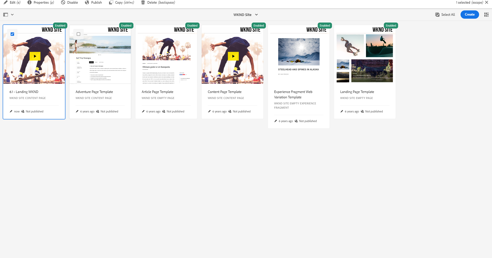

#### Structure do template

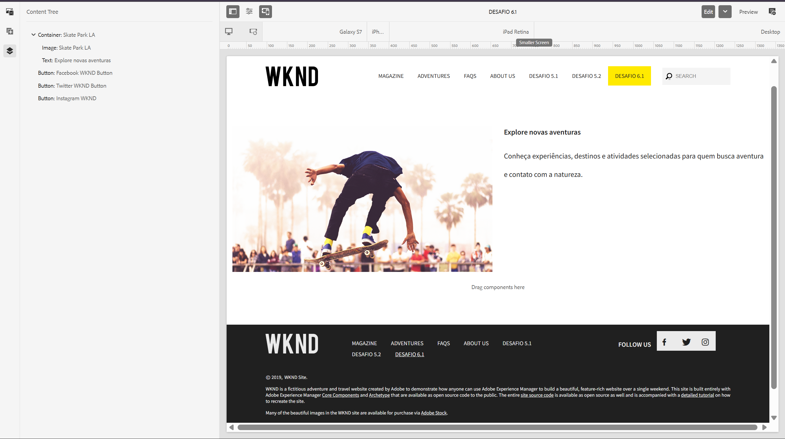

#### Componentes permitidos no template

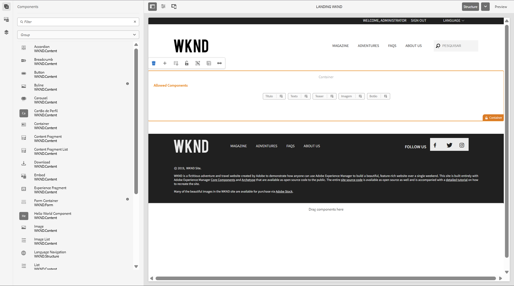

#### Componentes disponíveis no editor

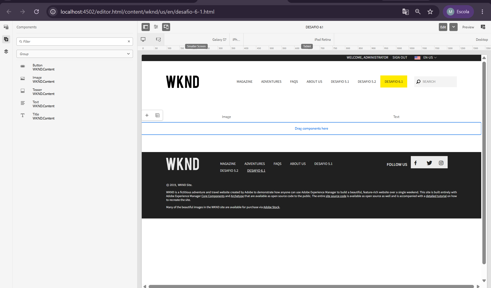

#### Layout organizado em colunas

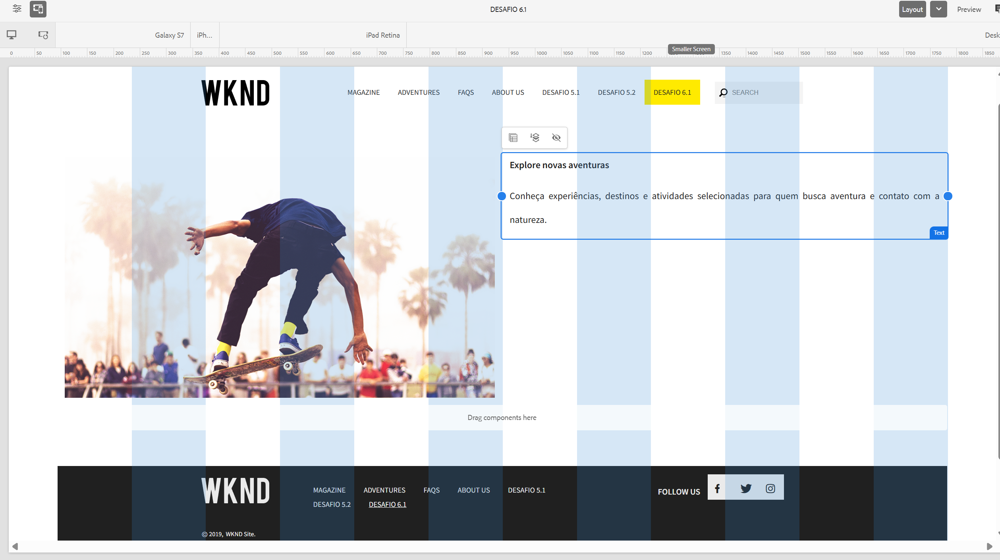

#### Página final

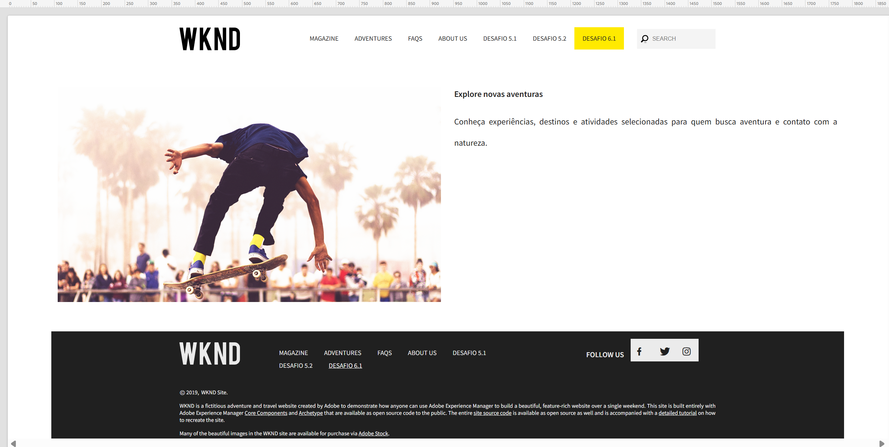

#### Policy registrada no JCR

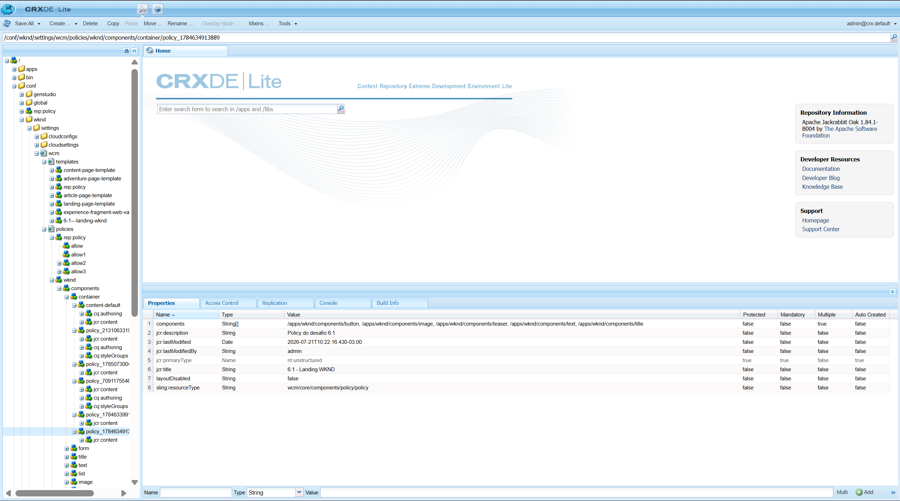

### Demonstração em vídeo

[Assistir à demonstração do Desafio 6.1](exercicios/semana-6/6.1-editableTemplate-politicas/docs/6-1-demonstracao.mp4)

---

## Desafio 6.2 — Componente Full-Stack: Destaque Estilizado

O objetivo do desafio foi criar um componente AEM completo, reunindo configuração de conteúdo, lógica Java, apresentação em HTL, estilos próprios, comportamento no navegador e variações visuais controladas pelo autor.

O fluxo implementado foi:

```text
Dialog Touch UI
      ↓
Propriedades salvas no JCR
      ↓
DestaqueModel
      ↓
destaque.html
      ↓
Client Library wknd.destaque
      ↓
Style System
```

### Atividades realizadas

- Criação do componente `destaque` em `/apps/wknd/components/destaque`
- Registro do componente como `cq:Component`
- Definição de `jcr:title` e `componentGroup`
- Criação do Dialog Touch UI com quatro campos
- Persistência das propriedades no JCR
- Criação do `DestaqueModel`
- Uso de `@ValueMapValue`
- Criação dos getters para os valores configurados
- Implementação do método `isMostrarBotao()`
- Uso de `data-sly-use` para carregar o Sling Model
- Uso de `data-sly-test` para renderizar o botão condicionalmente
- Criação da client library `wknd.destaque`
- Inclusão de CSS e JavaScript próprios
- Inclusão da client library por `data-sly-call`
- Criação do Design Dialog para habilitar o Style System
- Configuração dos estilos Claro e Escuro na policy
- Criação da página `Desafio 6.2`
- Teste do botão com URL preenchida e vazia
- Teste das duas variações visuais
- Exportação de um pacote auxiliar pelo AEM Package Manager

### Estrutura do componente

```text
6.2-destaque-estilizado/
├── desafio/
│   ├── component/
│   │   └── destaque/
│   │       ├── .content.xml
│   │       ├── destaque.html
│   │       ├── _cq_dialog/
│   │       │   └── .content.xml
│   │       ├── _cq_design_dialog/
│   │       │   └── .content.xml
│   │       └── clientlibs/
│   │           ├── .content.xml
│   │           ├── css.txt
│   │           ├── js.txt
│   │           ├── css/
│   │           │   └── destaque.css
│   │           └── js/
│   │               └── destaque.js
│   ├── models/
│   │   └── DestaqueModel.java
│   └── desafio-6-2-1.0.0.zip
└── docs/
    ├── 6.2-botoes.png
    ├── 6.2-dialog.png
    ├── 6.2-policies-temas.png
    ├── 6.2-tema-escuro.png
    └── 6.2-temas.png
```

### Definição do componente

O componente foi registrado com:

```xml
<jcr:root
    xmlns:cq="http://www.day.com/jcr/cq/1.0"
    xmlns:jcr="http://www.jcp.org/jcr/1.0"
    jcr:primaryType="cq:Component"
    jcr:title="Destaque Estilizado"
    jcr:description="Componente de destaque com botão condicional e estilos configuráveis."
    componentGroup="WKND.Content"/>
```

A propriedade:

```xml
jcr:primaryType="cq:Component"
```

registra o nó como um componente do AEM.

O nome exibido ao autor é definido por:

```xml
jcr:title="Destaque Estilizado"
```

O componente foi disponibilizado no painel pelo grupo:

```xml
componentGroup="WKND.Content"
```

### Implementação do Dialog

O Dialog Touch UI possui quatro campos:

- Título
- Texto
- Texto do botão
- URL do botão

As propriedades são persistidas na instância do componente por meio de:

```xml
name="./titulo"
name="./texto"
name="./textoBotao"
name="./urlBotao"
```

Os nomes utilizados no Dialog correspondem aos atributos lidos pelo Sling Model:

```text
titulo
texto
textoBotao
urlBotao
```

A URL do botão foi mantida como opcional. Quando esse campo fica vazio, o botão deixa de ser renderizado.

### Implementação do Sling Model

O `DestaqueModel` foi adaptado a partir de um `Resource` e associado ao tipo do componente:

```java
@Model(
    adaptables = Resource.class,
    resourceType = DestaqueModel.RESOURCE_TYPE,
    defaultInjectionStrategy = DefaultInjectionStrategy.OPTIONAL
)
public class DestaqueModel {
```

O tipo do componente foi centralizado em:

```java
public static final String RESOURCE_TYPE = "wknd/components/destaque";
```

As quatro propriedades são injetadas com `@ValueMapValue`:

```java
@ValueMapValue
private String titulo;

@ValueMapValue
private String texto;

@ValueMapValue
private String textoBotao;

@ValueMapValue
private String urlBotao;
```

Os valores são disponibilizados por meio de getters.

A regra de exibição do botão foi implementada no Model:

```java
public boolean isMostrarBotao() {
    return urlBotao != null && !urlBotao.trim().isEmpty();
}
```

O método retorna `false` quando a URL é nula, vazia ou contém somente espaços. Dessa forma, a regra permanece na camada Java, enquanto o HTL apenas utiliza o resultado.

### Implementação no HTL

O Sling Model é carregado no `destaque.html` por:

```html
data-sly-use.model="com.adobe.aem.guides.wknd.core.models.DestaqueModel"
```

O título e o texto são renderizados somente quando possuem valor:

```html
<h2
    class="cmp-destaque__title"
    data-sly-test="${model.titulo}">
    ${model.titulo}
</h2>

<p
    class="cmp-destaque__text"
    data-sly-test="${model.texto}">
    ${model.texto}
</p>
```

O botão utiliza o retorno do método `isMostrarBotao()`:

```html
<a
    class="cmp-destaque__button"
    data-sly-test="${model.mostrarBotao}"
    href="${model.urlBotao @ context='uri'}">
    ${model.textoBotao}
</a>
```

Quando `model.mostrarBotao` retorna `false`, a tag `<a>` não é incluída no HTML final.

### Client Library

Foi criada uma client library própria com a categoria:

```text
wknd.destaque
```

O nó foi registrado como:

```xml
<jcr:root
    xmlns:cq="http://www.day.com/jcr/cq/1.0"
    xmlns:jcr="http://www.jcp.org/jcr/1.0"
    jcr:primaryType="cq:ClientLibraryFolder"
    categories="[wknd.destaque]"
    allowProxy="{Boolean}true"/>
```

A propriedade:

```xml
jcr:primaryType="cq:ClientLibraryFolder"
```

faz com que o AEM reconheça o diretório como uma biblioteca de recursos do navegador.

A categoria:

```xml
categories="[wknd.destaque]"
```

é o identificador utilizado pelo HTL para solicitar a biblioteca.

O `allowProxy` permite que os recursos armazenados em `/apps` sejam disponibilizados ao navegador por `/etc.clientlibs`.

Os arquivos foram registrados por:

```text
css.txt → css/destaque.css
js.txt  → js/destaque.js
```

A client library é carregada no HTL com:

```html
<sly
    data-sly-use.clientlib="/libs/granite/sightly/templates/clientlib.html"/>

<sly data-sly-call="${clientlib.css @ categories='wknd.destaque'}"/>

<sly data-sly-call="${clientlib.js @ categories='wknd.destaque'}"/>
```

O CSS controla a aparência do componente e das variações visuais. O JavaScript procura os elementos com:

```html
data-cmp-is="destaque"
```

e marca cada instância inicializada com:

```text
cmp-destaque--inicializado
data-destaque-inicializado="true"
```

### Design Dialog e Style System

Como o componente foi criado do zero, foi adicionado um Design Dialog em:

```text
/apps/wknd/components/destaque/cq:design_dialog
```

No código-fonte, ele corresponde à pasta:

```text
_cq_design_dialog
```

O Design Dialog inclui a aba padrão do Style System:

```xml
<styles
    jcr:primaryType="nt:unstructured"
    sling:resourceType="granite/ui/components/coral/foundation/include"
    path="/mnt/overlay/cq/gui/components/authoring/dialog/style/tab_design/styletab"/>
```

Na policy do componente foi criado o grupo:

```text
Tema
```

Com duas opções:

```text
Claro  → cmp-destaque--claro
Escuro → cmp-destaque--escuro
```

A combinação de estilos foi desabilitada para que apenas uma variação seja selecionada por vez.

As duas opções utilizam o mesmo HTL. O Style System adiciona a classe escolhida ao wrapper do componente, e o CSS altera as variáveis de cor do Destaque.

### Página criada no Author

A página de demonstração foi criada em:

```text
/content/wknd/us/en/desafio-6-2
```

O componente foi preenchido com:

```text
Título: Explore novas experiências
Texto: Descubra aventuras, destinos e atividades selecionadas para tornar sua próxima viagem inesquecível.
Texto do botão: Conheça as aventuras
URL do botão: /content/wknd/us/en/adventures.html
```

### Testes realizados

#### URL preenchida

Com a URL preenchida, o método:

```java
isMostrarBotao()
```

retornou `true`, e o botão foi renderizado com o link configurado.

#### URL vazia

A URL foi removida, mantendo o texto do botão preenchido.

O botão desapareceu completamente da página, validando a lógica do Sling Model e o uso de:

```html
data-sly-test="${model.mostrarBotao}"
```

#### Estilos Claro e Escuro

O autor alternou entre as opções disponíveis no Style System.

No estilo Claro, o componente utiliza fundo claro, texto escuro e botão escuro.

No estilo Escuro, o componente utiliza fundo escuro, texto claro e botão amarelo.

### Deploy

O Sling Model foi compilado e instalado com:

```powershell
mvn -pl core clean install -PautoInstallBundle
```

O componente, os Dialogs, o HTL e a client library foram instalados com:

```powershell
mvn -pl ui.apps clean install -PautoInstallPackage
```

### Pacote AEM

Foi criado o pacote auxiliar:

```text
exercicios/semana-6/6.2-destaque-estilizado/desafio/desafio-6-2-1.0.0.zip
```

O pacote contém os conteúdos armazenados no JCR:

```text
/apps/wknd/components/destaque
/conf/wknd/settings/wcm/templates/6-2---landing-wknd
/conf/wknd/settings/wcm/policies/wknd/components/destaque
/conf/wknd/settings/wcm/policies/wknd/components/container
/content/wknd/us/en/desafio-6-2
```

O código-fonte do `DestaqueModel` foi versionado separadamente porque sua execução depende do bundle OSGi gerado pelo módulo `core`.

### Arquivos relacionados

- `exercicios/semana-6/6.2-destaque-estilizado/desafio/models/DestaqueModel.java`
- `exercicios/semana-6/6.2-destaque-estilizado/desafio/component/destaque/.content.xml`
- `exercicios/semana-6/6.2-destaque-estilizado/desafio/component/destaque/destaque.html`
- `exercicios/semana-6/6.2-destaque-estilizado/desafio/component/destaque/_cq_dialog/.content.xml`
- `exercicios/semana-6/6.2-destaque-estilizado/desafio/component/destaque/_cq_design_dialog/.content.xml`
- `exercicios/semana-6/6.2-destaque-estilizado/desafio/component/destaque/clientlibs/.content.xml`
- `exercicios/semana-6/6.2-destaque-estilizado/desafio/component/destaque/clientlibs/css.txt`
- `exercicios/semana-6/6.2-destaque-estilizado/desafio/component/destaque/clientlibs/js.txt`
- `exercicios/semana-6/6.2-destaque-estilizado/desafio/component/destaque/clientlibs/css/destaque.css`
- `exercicios/semana-6/6.2-destaque-estilizado/desafio/component/destaque/clientlibs/js/destaque.js`
- `exercicios/semana-6/6.2-destaque-estilizado/desafio/desafio-6-2-1.0.0.zip`

### Evidências

#### Dialog Touch UI

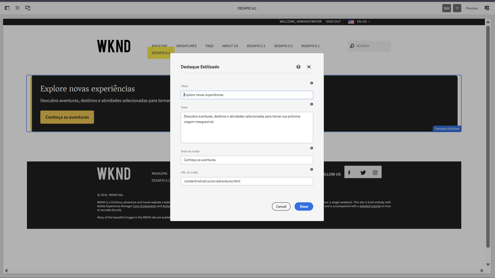

#### Botão condicional

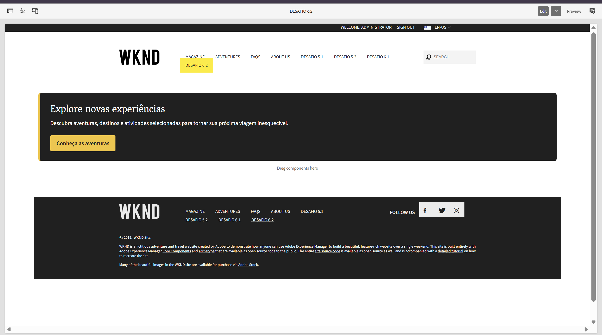

#### Policy do Style System

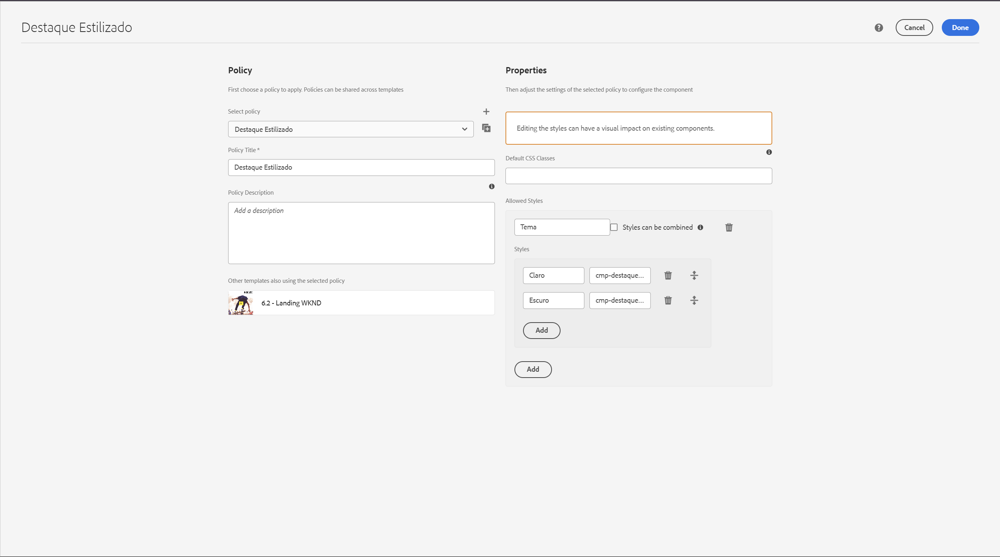

#### Opções de tema no editor

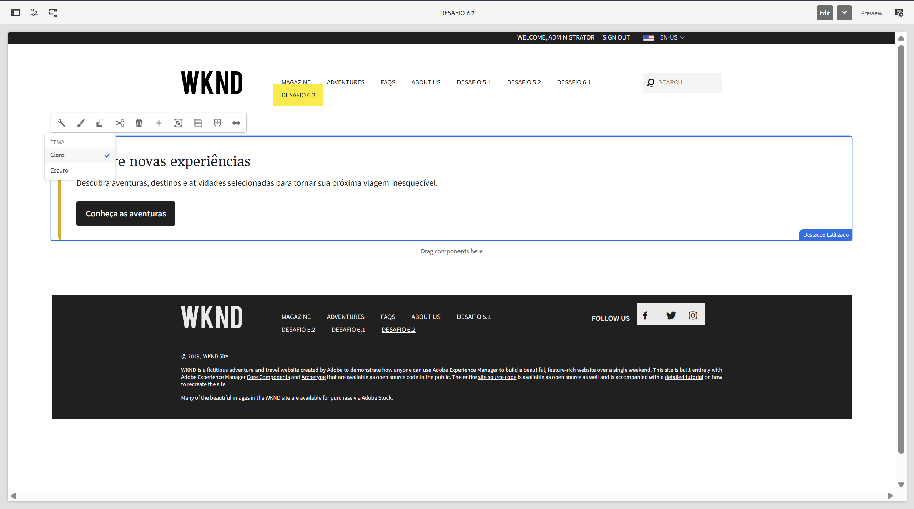

#### Componente com tema escuro

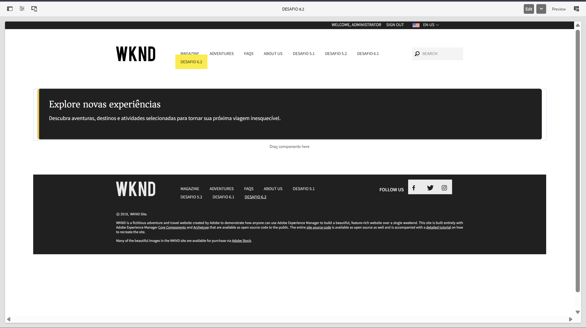

### Principais aprendizados

- Separação entre lógica no Sling Model e apresentação no HTL
- Implementação de comportamento condicional com um método booleano
- Uso de `data-sly-test` com o retorno de um Sling Model
- Criação de client libraries próprias no AEM
- Registro de categorias com `cq:ClientLibraryFolder`
- Uso de `css.txt` e `js.txt`
- Disponibilização de recursos por meio de `allowProxy`
- Inclusão de clientlibs com `data-sly-call`
- Criação de um Design Dialog para componentes customizados
- Configuração do Style System pela policy
- Uso de classes CSS para oferecer variações visuais
- Integração entre Java, HTL, CSS, JavaScript e JCR
- Diferença entre código-fonte Java e conteúdo exportado pelo Package Manager

---

# ⚙️ Informações do Projeto

## Tecnologias utilizadas

- JavaScript
- HTML
- CSS
- Liquid
- Shopify
- Shopify CLI
- Dawn Theme
- Adobe Experience Manager
- AEM Sites
- Core Components
- Editable Templates
- AEM Package Manager
- Client Libraries
- Style System
- Design Dialogs
- HTL
- Apache Sling
- Sling Models
- JCR
- OSGi
- Java
- Maven
- Git
- GitHub
- GitHub Copilot
- Markdown
- Visual Studio Code

---

# Padrão de branches

As branches seguem o padrão:

```text
exercicio/numero-do-desafio-nome-do-desafio
```

Exemplos:

```text
exercicio/1.1-fluxo-git
exercicio/1.2-caca-bugs
exercicio/1.3-com-sem-ia
exercicio/2.1-liquid-basico
exercicio/2.2-filtros-condicionais
exercicio/2.3-snippet-reutilizavel
exercicio/4.1-performance-audit
exercicio/4.2-tema-customizado
exercicio/5.1-helloworld-subtitulo
exercicio/5.2-componente-cartao-perfil
exercicio/6.1-editable-template-politicas
exercicio/6.2-destaque-estilizado
```

---

# Padrão de commits

Os commits seguem o padrão de commits semânticos:

```text
feat: nova funcionalidade
fix: correção de problema
docs: alteração na documentação
refactor: melhoria interna sem mudança de comportamento
perf: melhoria de performance
test: criação ou alteração de testes
chore: configuração ou tarefa auxiliar
```

Exemplos:

```text
docs: adicionar apresentação pessoal
feat: criar calculadora com operações básicas
fix: corrigir bugs em código gerado por IA
feat: criar section Liquid básica
feat: criar snippet reutilizável de produto
perf: otimizar imagens do tema
feat: criar FAQ customizada
feat: integrar metafields na section de preparo
feat(helloworld): adicionar subtitulo configuravel
docs: documentar desafio 5.1
feat(perfil): criar componente cartao de perfil
docs: documentar desafio 5.2
feat(aem): criar editable template com policies
docs: documentar desafio 6.1
feat(destaque): criar componente full-stack estilizado
docs: documentar desafio 6.2
```

---

# Como executar os arquivos JavaScript

Para executar os arquivos da Semana 1:

```bash
node exercicios/semana-1/calculadora.js
node exercicios/semana-1/caca-bugs-corrigido.js
node exercicios/semana-1/sem-ia.js
node exercicios/semana-1/com-ia.js
```

---

# Como testar os arquivos Shopify

## Iniciar o tema localmente

```bash
shopify theme dev --store=sua-loja.myshopify.com
```

## Executar o Theme Check

```bash
shopify theme check
```

Para mais detalhes:

```bash
shopify theme check --verbose
```

Meta:

```text
0 errors
```

---

# Como testar o AEM localmente

## 1. Iniciar o Author

```powershell
cd C:\aem-sdk\author
java -jar .\aem-author-p4502.jar
```

## 2. Abrir o Author

```text
http://localhost:4502
```

## 3. Entrar no projeto WKND

```text
Sites → WKND Site → United States → English
```

## 4. Abrir uma página de desafio

Desafio 5.1:

```text
/content/wknd/us/en/desafio-5-1
```

Desafio 5.2:

```text
/content/wknd/us/en/desafio-5-2
```

Desafio 6.1:

```text
/content/wknd/us/en/desafio-6-1
```

Desafio 6.2:

```text
/content/wknd/us/en/desafio-6-2
```

## 5. Testar o Desafio 5.1

1. Selecione o HelloWorld.
2. Clique no ícone de configuração.
3. Preencha `Text`.
4. Preencha `Subtítulo`.
5. Clique em `Done`.
6. Verifique o valor renderizado.

## 6. Testar o Desafio 5.2

1. Adicione o componente `Cartão de Perfil`.
2. Abra o Dialog.
3. Preencha Nome, Cargo e Biografia.
4. Clique em `Done`.
5. Confirme a exibição dos três valores.
6. Abra novamente o Dialog.
7. Apague o Cargo.
8. Salve e confirme que o Cargo não é renderizado.

## 7. Instalar e testar o Desafio 6.1

1. Abra o Package Manager em `http://localhost:4502/crx/packmgr/index.jsp`.
2. Clique em `Upload Package`.
3. Selecione o arquivo `exercicios/semana-6/6.1-editableTemplate-politicas/desafio-6-1-1.0.0.zip`.
4. Faça o upload e clique em `Install`.
5. Abra `Tools → General → Templates → WKND Site`.
6. Confirme a presença do template `6.1 - Landing WKND`.
7. Abra a página `/content/wknd/us/en/desafio-6-1`.
8. Verifique a imagem e o texto em duas colunas.
9. Confirme que o painel do container central apresenta apenas Button, Image, Teaser, Text e Title.

## 8. Instalar e testar o Desafio 6.2

1. Abra o Package Manager em `http://localhost:4502/crx/packmgr/index.jsp`.
2. Clique em `Upload Package`.
3. Selecione o arquivo `exercicios/semana-6/6.2-destaque-estilizado/desafio/desafio-6-2-1.0.0.zip`.
4. Faça o upload e clique em `Install`.
5. No projeto WKND original, instale o bundle com `mvn -pl core clean install -PautoInstallBundle`.
6. Abra a página `/content/wknd/us/en/desafio-6-2`.
7. Abra o Dialog do componente `Destaque Estilizado`.
8. Preencha Título, Texto, Texto do botão e URL do botão.
9. Confirme que o botão aparece quando a URL está preenchida.
10. Apague somente a URL e confirme que o botão deixa de ser renderizado.
11. Abra o Style System e alterne entre os estilos Claro e Escuro.
12. Confirme que o CSS e o JavaScript da categoria `wknd.destaque` estão carregados.

> O pacote do Desafio 6.2 contém o componente, a client library, o template, as policies e a página. O `DestaqueModel` precisa estar instalado no bundle OSGi do módulo `core`.

---

# Organização do projeto

O repositório contém:

- Exercícios semanais
- Código JavaScript
- Sections Liquid
- Snippets reutilizáveis
- Arquivos CSS
- Relatórios de performance
- Screenshots
- Reflexões sobre IA
- Componentes AEM
- Sling Models
- Dialogs Touch UI
- Scripts HTL
- Editable Templates
- Policies do AEM
- Pacotes instaláveis do AEM
- Client Libraries do AEM
- Design Dialogs
- Configurações do Style System
- Vídeos de demonstração
- Documentação em Markdown
- Arquivo `.gitignore`
- README atualizado

---

# 📚 Aprendizados gerais

Durante as atividades, foram praticados conceitos importantes para o desenvolvimento profissional.

Entre os principais aprendizados estão:

- IA pode acelerar o desenvolvimento, mas o código precisa ser revisado
- Commits pequenos facilitam a análise
- Branches evitam alterações diretas na `main`
- Pull Requests organizam a revisão
- Blocks são indicados para conteúdos repetíveis
- Metafields são indicados para dados específicos
- Responsividade deve ser validada em diferentes tamanhos
- Imagens precisam de dimensões definidas
- Lazy loading ajuda a reduzir carregamentos desnecessários
- Theme Check e Lighthouse ajudam a identificar problemas
- O AEM separa conteúdo, apresentação e lógica
- Dialogs controlam os dados preenchidos pelo autor
- Sling Models concentram a lógica Java
- HTL deve concentrar a apresentação
- Código Java precisa ser empacotado como bundle OSGi
- Maven garante builds reproduzíveis
- Documentação e evidências fazem parte da entrega
- Estrutura mínima de um componente AEM
- Diferença entre os módulos `core` e `ui.apps`
- Registro de componentes com `cq:Component`
- Criação de Dialogs Touch UI
- Persistência de propriedades no JCR
- Injeção com `@ValueMapValue`
- Uso de getters no Sling Model
- Carregamento de Model com `data-sly-use`
- Renderização condicional com `data-sly-test`
- Componentes AEM podem ser construídos do zero sem herança de Core Component
- O módulo `core` concentra o código Java e o módulo `ui.apps` concentra componentes, Dialogs e HTL
- Deploy separado de bundle OSGi e pacote de conteúdo
- Diferença entre Structure e Initial Content em Editable Templates
- Uso de policies para limitar o que o autor pode adicionar
- Reaproveitamento dos Core Components por meio de proxies do WKND
- Organização responsiva de componentes no Layout Mode
- Persistência de templates e policies dentro de `/conf`
- Exportação de conteúdo com filtros específicos no AEM Package Manager
- Diferença entre Template Type e Editable Template no AEM
- Função da Structure e do Initial Content no AEM
- Controle de edição por meio do bloqueio e desbloqueio de componentes no AEM
- Configuração de policies em `/conf` no AEM
- Restrição de componentes com Allowed Components no AEM
- Uso dos proxies dos Core Components do WKND no AEM
- Organização de componentes pela grade responsiva no AEM
- Uso do Layout Mode para criar colunas no AEM
- Herança de estrutura e conteúdo inicial pelas páginas no AEM
- Identificação de templates e policies no CRXDE Lite no AEM
- Exportação seletiva de conteúdo pelo AEM Package Manager
- Relação entre os nós do template, da policy e da página no JCR no AEM
- Criação de componentes full-stack com Dialog, Sling Model, HTL, CSS e JavaScript
- Implementação de regras condicionais no Sling Model
- Uso de métodos booleanos do Model no `data-sly-test`
- Criação de Client Libraries com categoria própria
- Organização de CSS e JavaScript por meio de `css.txt` e `js.txt`
- Uso de `allowProxy` para disponibilizar clientlibs armazenadas em `/apps`
- Inclusão de CSS e JavaScript no HTL por `data-sly-call`
- Criação de Design Dialog para componentes customizados
- Configuração de variações visuais pelo Style System
- Aplicação de classes CSS definidas em policies
- Diferença entre conteúdo JCR exportado e código Java executado em bundle OSGi
- Validação do HTML renderizado após o processamento do HTL no servidor

---

# 👤 Autor

**Emiliano Souza**
