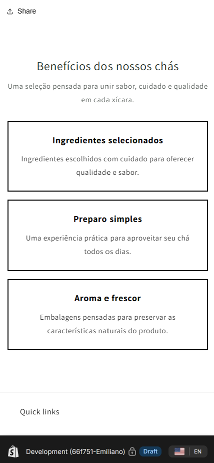
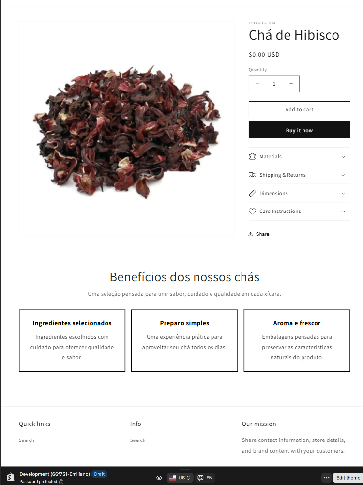
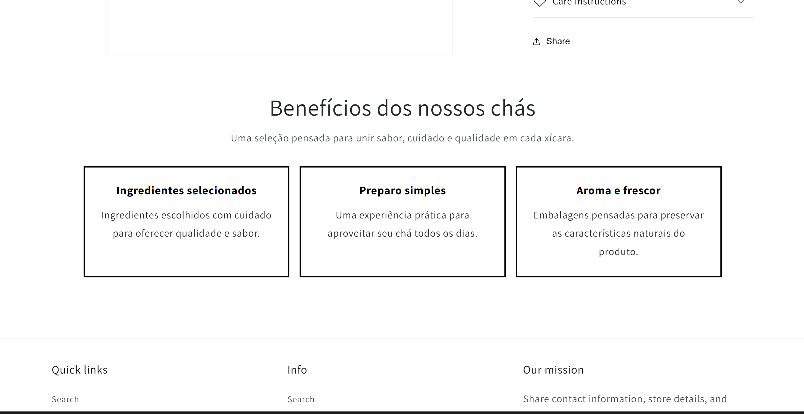
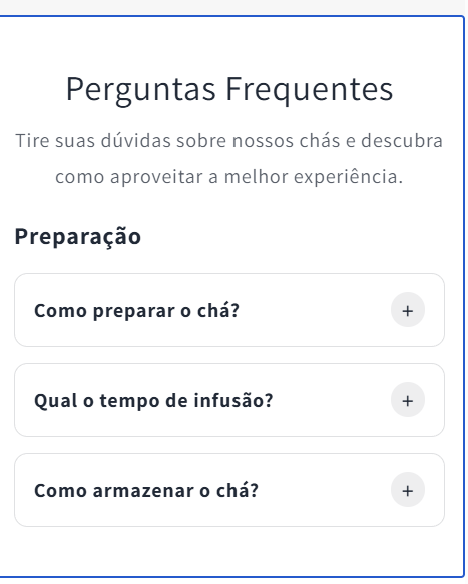
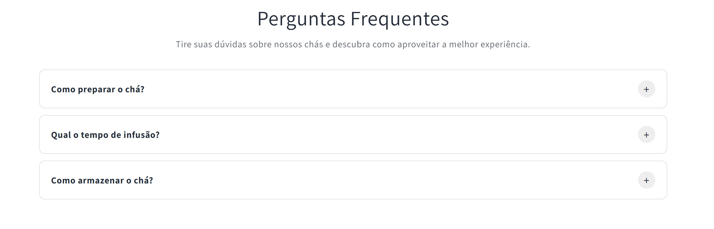
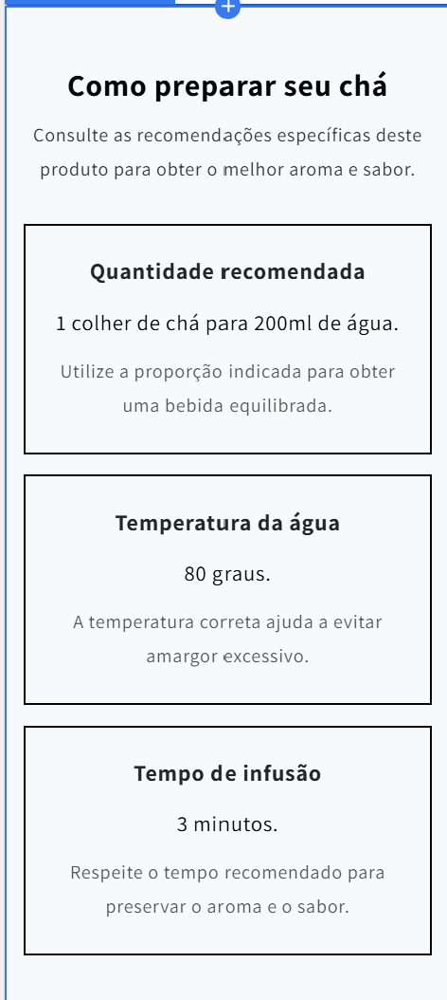
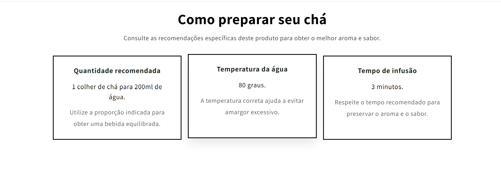

# Estágio Shopify

Repositório criado para armazenar os exercícios, desafios e atividades práticas desenvolvidos durante o programa de estágio/bootcamp da AI/R, com foco em desenvolvimento web, Git, GitHub, JavaScript, Shopify, Liquid e boas práticas de programação.

## 📌 Sobre o projeto

Este repositório faz parte da trilha de aprendizado do estágio/bootcamp da AI/R.

O objetivo é praticar conceitos fundamentais de desenvolvimento, como:

- Fluxo profissional com Git e GitHub
- Criação de branches
- Commits semânticos
- Pull Requests
- Code Review
- Identificação e correção de bugs
- Uso crítico de ferramentas de IA no desenvolvimento
- Desenvolvimento de temas Shopify
- Criação de sections em Liquid
- Uso de filtros, condicionais e loops
- Criação de snippets reutilizáveis
- Uso de blocks dinâmicos
- Configuração e exibição de metafields
- Responsividade
- Acessibilidade
- Auditoria e otimização de performance

---

## 📁 Estrutura do repositório

```text
estagio-shopify/
├── exercicios/
│   ├── semana-1/
│   │   ├── sobre-mim.md
│   │   ├── calculadora.js
│   │   ├── caca-bugs.md
│   │   ├── caca-bugs-corrigido.js
│   │   ├── sem-ia.js
│   │   ├── com-ia.js
│   │   ├── reflexao-ia.md
│   │   └── quando-usar-ia.md
│   │
│   ├── semana-2/
│   │   ├── sections/
│   │   │   ├── exercicio-liquid-basico.liquid
│   │   │   ├── exercicio-product-grid.liquid
│   │   │   └── exercicios-filtros.liquid
│   │   ├── snippets/
│   │   │   └── product-card.liquid
│   │   └── quando-usar-IA-liquid.md
│   │
│   ├── semana-3/
│   │   ├── hero-banner.liquid
│   │   ├── section-hero-banner.css
│   │   ├── product-extra-info.liquid
│   │   ├── section-product-extra-info.css
│   │   ├── brand-info.liquid
│   │   └── section-brand-info.css
│   │
│   └── semana-4/
│       ├── 4.1-Performance-audit/
│       │   ├── dawn/
│       │   │   ├── featured-product.liquid
│       │   │   ├── main-article.liquid
│       │   │   ├── main-list-collections.liquid
│       │   │   ├── main-product.liquid
│       │   │   ├── main-search.liquid
│       │   │   ├── password.liquid
│       │   │   └── theme.liquid
│       │   ├── desafios/
│       │   │   ├── banner-destaque.liquid
│       │   │   ├── brand-info.liquid
│       │   │   ├── exercicio-liquid-basico.liquid
│       │   │   ├── exercicio-product-grid.liquid
│       │   │   ├── exercicios-filtros.liquid
│       │   │   ├── hero-banner.liquid
│       │   │   ├── lista-caracteristicas.liquid
│       │   │   ├── pratica-filtros.liquid
│       │   │   ├── product-extra-info.liquid
│       │   │   ├── section-brand-info.css
│       │   │   ├── section-hero-banner.css
│       │   │   └── section-product-extra-info.css
│       │   └── docs/
│       │       ├── antes_inicial.png
│       │       ├── antes_produto.png
│       │       ├── depois_inicial.png
│       │       ├── depois_produto.png
│       │       ├── PERFORMANCE-REPORT.md
│       │       └── theme_check.png
│       │
│       └── 4.2-Tema-customizado/
│           ├── assets/
│           │   ├── 4-2-beneficios-produto.css
│           │   ├── 4-2-faq-custom.css
│           │   ├── 4-2-faq-custom.js
│           │   └── 4-2-preparo-produto.css
│           ├── sections/
│           │   ├── 4-2-beneficios-produto.liquid
│           │   ├── 4-2-faq-custom.liquid
│           │   └── 4-2-preparo-produto.liquid
│           └── docs/
│               ├── beneficios-mobile.png
│               ├── beneficios-tablet.png
│               ├── beneficios-desktop.png
│               ├── faq-mobile.png
│               ├── faq-desktop.png
│               ├── preparo-mobile.png
│               └── preparo-desktop.png
│
├── .gitignore
└── README.md
```

> Os arquivos Liquid foram organizados por semana e desafio para facilitar a avaliação. Para uso direto em um tema Shopify, os arquivos de section devem ser colocados em `sections/`, os snippets em `snippets/` e os arquivos CSS e JavaScript em `assets/`.

---

# ✅ Semana 1 — Git, JavaScript e IA

## Desafio 1.1 — Fluxo Git Profissional

Neste desafio, foram praticados os principais comandos e etapas de um fluxo profissional com Git e GitHub.

### Atividades realizadas

- Criação de branch a partir da `main`
- Criação da pasta `exercicios/semana-1`
- Criação do arquivo de apresentação pessoal
- Implementação de uma calculadora básica em JavaScript
- Adição da função de porcentagem
- Uso de commits semânticos
- Abertura de Pull Request
- Prática de review em código de colega

### Arquivos relacionados

- `exercicios/semana-1/sobre-mim.md`
- `exercicios/semana-1/calculadora.js`

---

## Desafio 1.2 — Caça aos Bugs da IA

Neste desafio, o foco foi desenvolver um olhar crítico sobre códigos gerados por inteligência artificial.

Foram analisados trechos com erros em:

- Validação de e-mail
- Busca de produto em array
- Cálculo de desconto
- Formatação de preço

Para cada trecho, foram descritos:

- Qual era o bug
- Por que o comportamento estava incorreto
- Como corrigir o problema
- Código corrigido com validações
- Tratamento de casos extremos

### Arquivos relacionados

- `exercicios/semana-1/caca-bugs.md`
- `exercicios/semana-1/caca-bugs-corrigido.js`

---

## Desafio 1.3 — Copilot: Com e Sem IA

Neste desafio, foram implementadas as mesmas funções de duas formas:

1. Sem uso de IA
2. Com auxílio do GitHub Copilot

### Funções implementadas

- `inverterString(str)`
- `contarVogais(str)`
- `encontrarMaior(numeros)`
- `removerDuplicatas(array)`

Também foi feita uma reflexão comparando:

- Tempo gasto com e sem IA
- Qualidade do código
- Tratamento de casos extremos
- Aprendizado durante o processo
- Pontos positivos e limitações do uso de IA

### Arquivos relacionados

- `exercicios/semana-1/sem-ia.js`
- `exercicios/semana-1/com-ia.js`
- `exercicios/semana-1/reflexao-ia.md`

---

## Mini-doc — Quando uso e quando não uso Copilot

Foi criado um documento com uma reflexão sobre o uso do GitHub Copilot durante as atividades.

O documento aborda:

- Situações em que o Copilot ajudou
- Situações em que o Copilot atrapalhou
- Cuidados ao usar IA para gerar código
- Importância de revisar e testar o código
- Necessidade de compreender as sugestões geradas

### Arquivo relacionado

- `exercicios/semana-1/quando-usar-ia.md`

---

# ✅ Semana 2 — Shopify, Liquid e Temas

Durante a Semana 2, foram realizados desafios para compreender a estrutura dos temas Shopify e a linguagem Liquid.

## Desafio 2.1 — Section Liquid Básica

Foi criada uma section básica em Liquid com configurações editáveis pelo editor visual da Shopify.

### Funcionalidades implementadas

- Título configurável via `settings`
- Descrição configurável com `richtext`
- Loop de produtos usando uma coleção
- Exibição de imagem, título e preço
- Preço formatado com o filtro `money`
- Controle da quantidade de produtos
- Alternância entre grade e lista
- Cor de fundo configurável
- Botão “Ver todos os produtos”

### Arquivo relacionado

- `exercicios/semana-2/sections/exercicio-liquid-basico.liquid`

---

## Desafio 2.2 — Filtros e Condicionais Liquid

Foi criada uma section para exibir produtos de uma coleção utilizando filtros e lógica condicional.

### Funcionalidades implementadas

- Seleção de coleção pelo editor visual
- Título da coleção com `upcase`
- Título dos produtos com `capitalize`
- Preço formatado com `money`
- Descrição tratada com `strip_html` e `truncate`
- Imagens redimensionadas com `image_url`
- Badge para produto em promoção
- Badge para produto esgotado
- Badge para produto disponível
- Cálculo da porcentagem de desconto
- Contagem de produtos em promoção
- Resumo dinâmico com `capture`

### Arquivo relacionado

- `exercicios/semana-2/sections/exercicios-filtros.liquid`

---

## Desafio 2.3 — Snippet Reutilizável

Foi criado um snippet reutilizável de card de produto e uma section de grade que utiliza o snippet com ``.

### Funcionalidades do snippet

- Imagem do produto
- Título com link
- Preço atual formatado
- Preço original riscado em promoções
- Badge de promoção
- Badge de produto esgotado
- Botão visual de adicionar ao carrinho
- Botão desabilitado para produtos indisponíveis

### Funcionalidades da section

- Seleção de coleção
- Controle do número de colunas
- Controle do limite de produtos
- Opção para mostrar ou ocultar badges
- Cor de fundo configurável
- Link para todos os produtos
- Layout responsivo

### Arquivos relacionados

- `exercicios/semana-2/snippets/product-card.liquid`
- `exercicios/semana-2/sections/exercicio-product-grid.liquid`

---

## Mini-doc — Uso de IA em Liquid

Foi criado um documento com uma reflexão sobre o uso de IA nos exercícios de Liquid.

O conteúdo aborda:

- Como a IA ajudou na criação de sections
- Como a IA ajudou na organização da lógica
- Sugestões que precisaram ser revisadas
- Importância de testar no preview da Shopify
- Cuidados com estoque, promoção e configurações do editor

### Arquivo relacionado

- `exercicios/semana-2/quando-usar-IA-liquid.md`

---

# ✅ Semana 3 — Metafields, Metaobjects e Blocks Dinâmicos

Durante a Semana 3, o foco foi aprofundar a personalização de temas Shopify utilizando metafields, metaobjects e blocks dinâmicos.

## Desafio 3.1 — Hero Banner com Blocks Dinâmicos

Foi criada uma section `Hero Banner` flexível e configurável pelo editor visual.

### Funcionalidades implementadas

- Imagem de fundo
- Overlay com opacidade configurável
- Altura mínima configurável
- Alinhamento do conteúdo
- Block de título
- Block de parágrafo
- Block de botão
- Block de imagem
- Adição, remoção e reordenação de blocks
- Layout adaptado para desktop e mobile

### Arquivos relacionados

- `exercicios/semana-3/hero-banner.liquid`
- `exercicios/semana-3/section-hero-banner.css`

---

## Desafio 3.2 — Metafields e Metaobjects

Neste desafio, foram criadas estruturas de dados personalizadas para enriquecer páginas de produto.

### Funcionalidades implementadas

- Metafields de produto
- Material
- Instruções de cuidado
- Vídeo do produto
- Metaobject de informações de marca
- Logo da marca
- Descrição
- Site
- País
- Referência de metaobject ligada ao produto
- Exibição condicional dos dados

### Arquivos relacionados

- `exercicios/semana-3/product-extra-info.liquid`
- `exercicios/semana-3/brand-info.liquid`
- `exercicios/semana-3/section-product-extra-info.css`
- `exercicios/semana-3/section-brand-info.css`

---

# ✅ Semana 4 — Performance e Tema Customizado

Durante a Semana 4, o foco foi auditar e otimizar um tema Shopify e desenvolver sections customizadas completas para o tema Dawn.

---

## Desafio 4.1 — Auditoria de Performance

Foi realizada uma auditoria de performance nas sections customizadas e em arquivos do tema Dawn.

### Otimizações implementadas

- Lazy loading em imagens abaixo da dobra
- `loading="eager"` em imagens acima da dobra
- `fetchpriority="high"` em imagens prioritárias
- Inclusão de `width` e `height` nas imagens
- Redução de layout shift
- Critical CSS para conteúdo inicial
- Carregamento assíncrono de CSS quando aplicável
- JavaScript com `defer` ou `async`
- Limites em loops Liquid
- Revisão de lookups repetidos
- Remoção de tags depreciadas
- Correções apontadas pelo Theme Check
- Auditoria com Lighthouse
- Comparação antes e depois

### Arquivos relacionados

- `exercicios/semana-4/4.1-Performance-audit/desafios/banner-destaque.liquid`
- `exercicios/semana-4/4.1-Performance-audit/desafios/lista-caracteristicas.liquid`
- `exercicios/semana-4/4.1-Performance-audit/desafios/pratica-filtros.liquid`
- `exercicios/semana-4/4.1-Performance-audit/desafios/hero-banner.liquid`
- `exercicios/semana-4/4.1-Performance-audit/desafios/brand-info.liquid`
- `exercicios/semana-4/4.1-Performance-audit/desafios/product-extra-info.liquid`
- `exercicios/semana-4/4.1-Performance-audit/docs/PERFORMANCE-REPORT.md`
- `exercicios/semana-4/4.1-Performance-audit/dawn/`

### Evidências

- Screenshot do Lighthouse antes das otimizações
- Screenshot do Lighthouse depois das otimizações
- Screenshot do Theme Check
- Relatório de performance

---

## Desafio 4.2 — Tema Customizado Completo

Neste desafio, foi desenvolvido um conjunto de sections customizadas para o tema Dawn, com foco em flexibilidade, responsividade, metafields e código organizado.

Foram criadas três sections:

- FAQ Custom
- Benefícios do produto
- Preparo do produto

---

### FAQ Custom

Section de perguntas frequentes com comportamento de accordion.

#### Funcionalidades

- Perguntas expansíveis com `<details>` e `<summary>`
- Dois tipos diferentes de block
- Block de categoria
- Block de pergunta e resposta
- Blocks adicionáveis
- Blocks removíveis
- Blocks reordenáveis
- Preset com conteúdo inicial
- Abertura de apenas uma pergunta por vez
- Compatibilidade com o editor visual
- JavaScript carregado com `defer`
- Layout responsivo
- Foco visível para navegação por teclado
- Suporte a `prefers-reduced-motion`

#### Arquivos relacionados

- `exercicios/semana-4/4.2-Tema-customizado/sections/4-2-faq-custom.liquid`
- `exercicios/semana-4/4.2-Tema-customizado/assets/4-2-faq-custom.css`
- `exercicios/semana-4/4.2-Tema-customizado/assets/4-2-faq-custom.js`

---

### Benefícios do produto

Section para apresentar os principais benefícios do produto por meio de cards configuráveis.

#### Funcionalidades

- Cards criados por blocks
- Ícone configurável
- Título configurável
- Descrição configurável
- Cor de fundo da section
- Cor do título e subtítulo
- Cor de fundo dos cards
- Cor dos textos internos
- Cor da borda
- Espessura da borda
- Arredondamento dos cards
- Layout responsivo
- Último card centralizado no tablet quando a quantidade é ímpar
- Imagens com lazy loading
- Imagens com dimensões definidas

#### Arquivos relacionados

- `exercicios/semana-4/4.2-Tema-customizado/sections/4-2-beneficios-produto.liquid`
- `exercicios/semana-4/4.2-Tema-customizado/assets/4-2-beneficios-produto.css`

---

### Preparo do produto

Section criada para apresentar informações de preparo específicas de cada produto.

#### Funcionalidades

- Cards de preparo configuráveis
- Ícone opcional por card
- Nome da etapa
- Valor manual de reserva
- Integração com metafields
- Cor de fundo da section
- Cor do título e subtítulo
- Cor de fundo dos cards
- Cor dos textos internos
- Cor do valor em destaque
- Cor da borda
- Espessura da borda
- Arredondamento
- Espaçamento interno
- Espaço entre os cards
- Layout responsivo
- Último card centralizado no tablet quando a quantidade é ímpar
- Imagens com lazy loading
- Imagens com `width` e `height`

#### Metafields utilizados

| Nome | Namespace e chave | Tipo |
|---|---|---|
| Temperatura de preparo | `custom.temperatura_preparo` | Texto de linha única |
| Tempo de infusão | `custom.tempo_infusao` | Texto de linha única |
| Quantidade recomendada | `custom.quantidade_recomendada` | Texto de linha única |

Os três metafields foram configurados para produtos e devem ser preenchidos em pelo menos dois produtos.

#### Exemplo de preenchimento

| Produto | Temperatura | Tempo de infusão | Quantidade |
|---|---|---|---|
| Chá verde | 80 °C | 3 minutos | 1 colher para 200 ml |
| Camomila | 95 °C | 5 minutos | 1 colher para 250 ml |

#### Arquivos relacionados

- `exercicios/semana-4/4.2-Tema-customizado/sections/4-2-preparo-produto.liquid`
- `exercicios/semana-4/4.2-Tema-customizado/assets/4-2-preparo-produto.css`

---

## Responsividade do Desafio 4.2

As sections foram desenvolvidas para funcionar nas seguintes faixas:

- Mobile: 320 px a 767 px
- Tablet: 768 px a 1023 px
- Desktop: 1024 px ou mais

### Resoluções utilizadas nos testes

- 320 px
- 375 px
- 768 px
- 1024 px
- 1440 px

Foram verificados:

- Textos cortados
- Cards fora da tela
- Rolagem horizontal
- Quebra de colunas
- Espaçamentos
- Imagens distorcidas
- Funcionamento da FAQ
- Exibição dos metafields
- Centralização de cards ímpares

---

## Screenshots do Desafio 4.2

> Os arquivos abaixo devem estar dentro de `exercicios/semana-4/4.2-Tema-customizado/docs/`.

### Benefícios do produto

#### Mobile



#### Tablet



#### Desktop



### FAQ Custom

#### Mobile



#### Desktop



### Preparo do produto

#### Mobile



#### Desktop



---

## Decisões de design do Desafio 4.2

As principais decisões tomadas foram:

- Uso de cards para facilitar a leitura
- Separação das cores externas e internas
- Configuração de bordas pelo editor visual
- Uso de metafields apenas para dados específicos de cada produto
- Uso de blocks para conteúdos repetíveis
- Uso de fallback manual quando o metafield estiver vazio
- Centralização do último card em layouts de tablet
- Uso de classes no padrão BEM
- Separação entre Liquid, CSS e JavaScript
- Uso de HTML semântico
- Uso de imagens decorativas com `alt=""`

---

## Dificuldades encontradas no Desafio 4.2

Durante o desenvolvimento, algumas dificuldades precisaram ser resolvidas:

- Definir quais informações deveriam ser blocks ou metafields
- Evitar a criação desnecessária de muitos metafields
- Centralizar uma quantidade ímpar de cards no tablet
- Separar as cores internas e externas
- Permitir a configuração das bordas pelo editor
- Manter os cards responsivos
- Garantir que os metafields tivessem valores manuais de reserva
- Manter o JavaScript da FAQ funcionando dentro do editor visual

---

## Tecnologias utilizadas

- JavaScript
- Liquid
- Shopify
- Shopify CLI
- Dawn Theme
- Git
- GitHub
- GitHub Copilot
- Markdown
- HTML
- CSS

---

## Padrão de branches

As branches seguem o padrão:

```text
exercicio/numero-do-desafio-nome-do-desafio
```

Exemplos:

```text
exercicio/1.1-fluxo-git
exercicio/1.2-caca-bugs
exercicio/1.3-com-sem-ia
exercicio/2.1-liquid-basico
exercicio/2.2-filtros-condicionais
exercicio/2.3-snippet-reutilizavel
exercicio/4.1-performance-audit
exercicio/4.2-tema-customizado
```

---

## Padrão de commits

Os commits seguem o padrão de commits semânticos:

```text
feat: nova funcionalidade
fix: correção de bug
docs: alteração em documentação
refactor: melhoria no código sem alterar comportamento
perf: melhoria de performance
chore: configuração ou tarefa auxiliar
```

Exemplos:

```text
docs: adicionar apresentação pessoal
feat: criar calculadora com operações básicas
feat: adicionar cálculo de porcentagem
fix: corrigir bugs em código gerado por IA
docs: adicionar reflexão sobre uso de IA
feat: criar section Liquid básica
feat: criar section com filtros e condicionais
feat: criar snippet reutilizável de produto
perf: otimizar imagens e carregamento do tema
feat: criar FAQ customizada com blocks
feat: criar section de benefícios do produto
feat: integrar metafields na section de preparo
fix: centralizar cards ímpares no tablet
docs: documentar desafio 4.2 no README
```

---

## Como executar os arquivos JavaScript

Para executar os arquivos JavaScript da Semana 1, é necessário ter o Node.js instalado.

Exemplos:

```bash
node exercicios/semana-1/calculadora.js
node exercicios/semana-1/caca-bugs-corrigido.js
node exercicios/semana-1/sem-ia.js
node exercicios/semana-1/com-ia.js
```

---

## Como testar os arquivos Liquid no Shopify

## 1. Copiar os arquivos para o tema

Copie os arquivos `.liquid` para:

```text
sections/
```

Copie os arquivos `.css` e `.js` para:

```text
assets/
```

Exemplo:

```text
sections/4-2-faq-custom.liquid
sections/4-2-beneficios-produto.liquid
sections/4-2-preparo-produto.liquid

assets/4-2-faq-custom.css
assets/4-2-faq-custom.js
assets/4-2-beneficios-produto.css
assets/4-2-preparo-produto.css
```

## 2. Iniciar o ambiente local

Dentro da pasta do tema, execute:

```bash
shopify theme dev --store=sua-loja.myshopify.com
```

## 3. Abrir o editor visual

No editor visual da Shopify:

1. Abra o template de produto.
2. Clique em `Adicionar seção`.
3. Adicione as sections customizadas.
4. Configure cores, bordas e conteúdos.
5. Salve as alterações.

---

## Como configurar os metafields

No painel administrativo da Shopify:

1. Acesse `Configurações`.
2. Entre em `Dados personalizados`.
3. Selecione `Produtos`.
4. Crie as três definições.

Use:

```text
custom.temperatura_preparo
custom.tempo_infusao
custom.quantidade_recomendada
```

Configure as três como texto de linha única.

Depois:

1. Abra um produto.
2. Preencha os três campos.
3. Repita em pelo menos outro produto.
4. Abra o preview.
5. Verifique se os valores aparecem nos cards.

---

## Como testar a responsividade

No Google Chrome:

1. Abra o preview.
2. Pressione `F12`.
3. Use `Ctrl + Shift + M`.
4. Escolha o modo responsivo.
5. Digite manualmente as larguras.

Teste:

```text
320 px
375 px
768 px
1024 px
1440 px
```

Verifique:

- Quebra dos cards
- Centralização
- Espaçamentos
- Textos
- Imagens
- Bordas
- Funcionamento da FAQ
- Exibição dos metafields

---

## Como executar o Theme Check

Dentro da pasta do tema, execute:

```bash
shopify theme check
```

Para obter mais detalhes:

```bash
shopify theme check --verbose
```

A meta da entrega é:

```text
0 errors
```

Warnings restantes devem ser analisados e justificados.

---

## Organização do projeto

O repositório contém:

- Exercícios semanais
- Sections Liquid
- Snippets reutilizáveis
- Arquivos CSS
- Arquivos JavaScript
- Relatórios de performance
- Screenshots de validação
- Reflexões sobre IA
- Documentação em Markdown
- `.gitignore`
- README atualizado

---

## Aprendizados

Durante as atividades, foram praticados conceitos importantes para o desenvolvimento profissional, como organização de código, versionamento, revisão, análise crítica de código gerado por IA e documentação.

Na Semana 1, o foco foi Git, GitHub, JavaScript e uso crítico de IA.

Na Semana 2, o foco foi Shopify, Liquid, filtros, condicionais e componentes reutilizáveis.

Na Semana 3, o foco foi personalização avançada com metafields, metaobjects e blocks dinâmicos.

Na Semana 4, o foco foi performance, acessibilidade, responsividade e desenvolvimento de um tema customizado completo.

Os principais aprendizados foram:

- IA pode acelerar o desenvolvimento, mas todo código precisa ser revisado
- Blocks são indicados para conteúdos repetíveis
- Metafields são indicados para dados específicos de produtos
- Sections devem ser configuráveis pelo editor visual
- Responsividade deve ser testada em diferentes resoluções
- Lazy loading e dimensões de imagem ajudam na performance
- Código limpo facilita manutenção
- Documentação é parte importante da entrega
- Theme Check e Lighthouse ajudam a identificar problemas reais

---

## 👤 Autor

**Emiliano Souza**