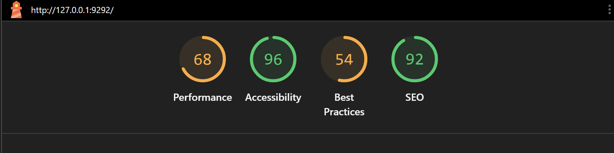
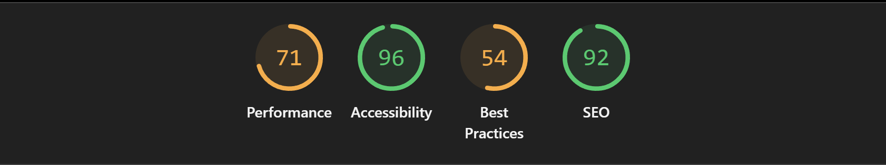
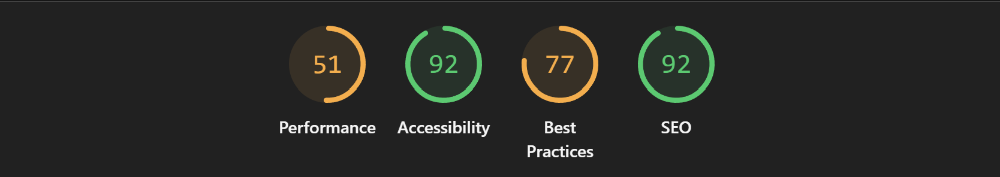
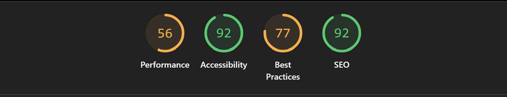
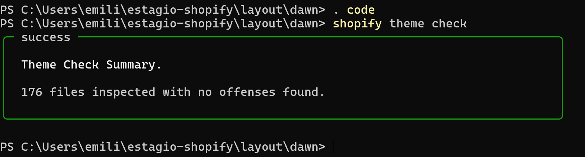

# Performance Report — Dawn Theme (Desafio 4.1)

## 1. Resumo

Foi realizada uma auditoria de performance nas sections desenvolvidas durante os desafios anteriores. Foram implementadas otimizações de lazy loading, carregamento assíncrono de CSS, definição de dimensões para imagens, otimização de loops Liquid e revisão do Theme Check. As alterações resultaram em melhoria nos indicadores de Performance do Lighthouse, mantendo a compatibilidade com o tema Dawn.

---

## 2. Diagnóstico Inicial

### Theme Check (antes)
| Tipo | Quantidade |
|---|---|
| Errors | 0 |
| Warnings | 8 (Todos do Theme Dawn)|
| Suggestions | — |

**Problemas identificados:**
1. UndefinedObject - continue em `main-product.liquid`.
2. UndefinedObject - scheme_classes em `theme.liquid` e `password.liquid`
3. UnusedAssign - seo_media em `featured-product.liquid`
4. UnusedAssign - product_settings em `main-search.liquid`
5. OrphanedSnippet - `quick-order-product-row.liquid`

Todos os warnings identificados pelo Theme Check pertenciam aos arquivos nativos do tema Dawn e não foram introduzidos pelas sections desenvolvidas durante os desafios anteriores.

### Lighthouse, Página Inicial (antes)
| Categoria | Score Inicial |
|---|---|
| Performance | 68 |
| Accessibility | 96 |
| Best Practices | 54 |
| SEO | 92 |

### Lighthouse, Página Produto (antes)
| Categoria | Score Inicial |
|---|---|
| Performance | 51 |
| Accessibility | 92 |
| Best Practices | 77 |
| SEO | 92 |

---

## 3. Correções Implementadas

As seguintes correções referem-se às sections desenvolvidas nas semanas anteriores, adequando-as às recomendações do desafio de auditoria de performance.

### 2.1 — Lazy Loading
| Arquivo | Imagem | Implementação |
|---|---|---|
| `hero-banner.liquid` | Imagem de fundo e bloco image | `loading: 'eager'` (acima do fold) ✅ |
| `brand-info.liquid` | Logo da marca | `loading="lazy"` ✅ |
| `exercicio-liquid-basico.liquid` | Produtos | `loading="lazy"` ✅ |
| `exercicios-filtros.liquid` | Produtos | `loading="lazy"` ✅ |
| `pratica-filtros.liquid` | Produtos | `loading="lazy"` ✅ |
| `banner-destaque.liquid` | `background-image` CSS | N/A — não usa `` ✅ |

### 2.2 — Critical CSS
| Arquivo | CSS Crítico Inline | CSS Externo |
|---|---|---|
| `hero-banner.liquid` | Layout, overlay, conteúdo, botões | `section-hero-banner.css` assíncrono ✅ |
| `brand-info.liquid` | Card, logo, título, nome | `section-brand-info.css` assíncrono ✅ |
| `product-extra-info.liquid` | Container, título, material, acordeão | `section-product-extra-info.css` assíncrono ✅ |

### 2.3 — Defer/Async em JavaScript
- Nenhum `<script>` próprio nas sections customizadas
- Scripts do `theme.liquid` (Dawn padrão) já usam `defer="defer"` ✅

### 2.4 — Otimizar Liquid
| Problema | Arquivo | Correção |
|---|---|---|
| Loop sem `limit` | `exercicios-filtros.liquid` | `limit: 50` adicionado ✅ |
| Uso de `` | Nenhum encontrado | N/A ✅ |
| Variáveis não usadas | Nenhuma encontrada | N/A ✅ |

### 2.5 — Width/Height em imagens
| Arquivo | Antes | Depois |
|---|---|---|
| `exercicio-liquid-basico.liquid` | `width="300" height="300"` | `width="{{ product.featured_image.width }}" height="{{ product.featured_image.height }}"` ✅ |
| `exercicios-filtros.liquid` | `width="300" height="300"` | dimensões reais ✅ |
| `pratica-filtros.liquid` | `width="400" height="400"` | dimensões reais ✅ |
| `brand-info.liquid` | `width="200" height="200"` | fixo aceitável (logo tem tamanho controlado) ⚠️ |

---

## 4. Resultados

### Theme Check (depois)
| Tipo | Quantidade |
|---|---|
| Errors | 0 ✅ |
| Warnings | 0 (nas sections customizadas) ✅ |

### Lighthouse, Página Inicial (depois)
| Categoria | Score Inicial | Score Final | Melhoria |
|---|---|---|---|
| Performance | 68 | 71 | 3 |
| Accessibility | 96 | 96 | 0 |
| Best Practices | 54 | 54 | 0 |
| SEO | 92 | 92 | 0 |

### Lighthouse, Página Produto (depois)
| Categoria | Score Inicial | Score Final | Melhoria |
|---|---|---|---|
| Performance | 51 | 56 | 5 |
| Accessibility | 92 | 92 | 0 |
| Best Practices | 77 | 77 | 0 |
| SEO | 92 | 92 | 0 |

---

## 5. O que não foi possível corrigir

- **`Brand-info.liquid` — dimensões da logo:** O metafield `marca.logo` é do tipo `file_reference` e não expõe as propriedades `.width` e `.height` como um objeto image nativo do Shopify. Por isso foram mantidas dimensões fixas (200x200), compatíveis com o layout definido em CSS.
- **Critical CSS no `theme.liquid`:** O exercício limitou as modificações às sections customizadas. O `base.css` do Dawn continua sendo carregado de forma bloqueante — isso seria a próxima otimização a implementar em um contexto de produção.

---

## Conclusão

Houve ganhos modestos de otimização. Muitas das otimizações solicitadas pelo desafio já estavam presentes, seja nas sections desenvolvidas anteriormente, seja no próprio tema Dawn. Assim, esta auditoria concentrou-se em revisar, complementar e padronizar essas implementações, corrigindo pontos específicos que ainda não atendiam completamente às boas práticas de performance.

---

## 7. Screenshots

**Antes, página inicial:**

---
**Depois, página inicial:**

---
**Antes, página de produto:**

---
**Depois, página de produto:**

---
**Theme Check:**

---